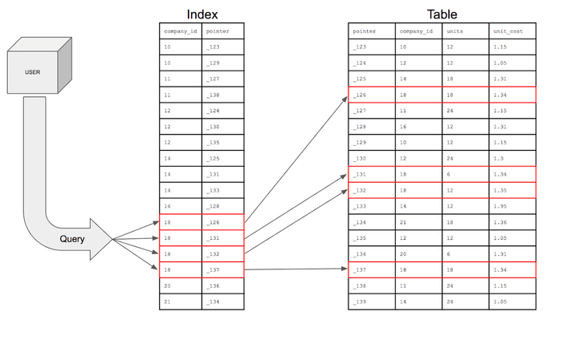
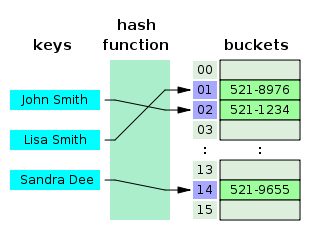
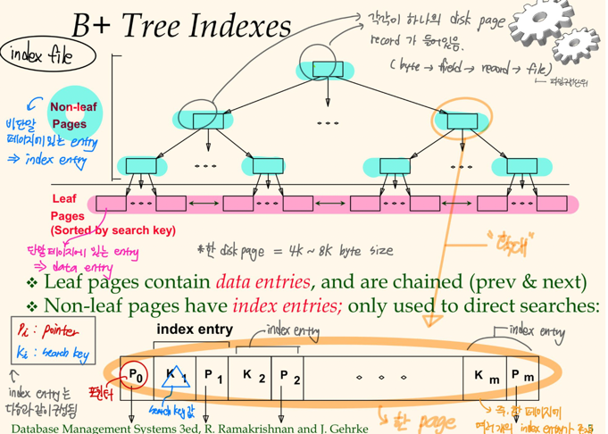

# 인덱스(index)

## 💡인덱스(index)란

인덱스란 **추가적인 쓰기 작업과 저장 공간을 활용하여 데이터베이스 테이블의 검색 속도를 향상시키기 위한 자료구조**입니다.   
만약 우리가 책에서 원하는 내용을 찾는다고 하면, 책의 모든 페이지를 찾아 보는것은 오랜 시간이 걸립니다. 그렇기 때문에 책의 저자들은 책의 맨 앞 또는 맨 뒤에 색인을 추가하는데, 데이터베이스의 index는 책의 색인과 같습니다.   
데이터베이스에서도 테이블의 모든 데이터를 검색하면 시간이 오래 걸리기 때문에 ```데이터```와 ```데이터의 위치를 포함한 자료구조```를 생성하여 빠르게 조회할 수 있도록 돕고 있습니다.   

> ### 인덱스 요약정리
> 
> 인덱스(Index file)은 ```트리``` 또는 ```해싱```을 통해 레코드를 구성하는 데이터 구조로,
> 정렬된 파일과 마찬가지로 특정("검색 키") 필드의 값을 기반으로 레코드 하위 집합에 대한 검색 속도를 높입니다.
> 
> 인덱스에서 검색 대상 열(Column)의 값을 효율적으로 검색하기 위한 값은 ```Search Key(검색키)```이며,   
> 검색 대상 열의 값을 가진 레코드의 위치 정보(주소정보, =RID)를 가지고 있는 ```Data Entry(데이터 엔트리)```로 구성됩니다.
> 
> 데이터 엔트리는 검색 작업 시 검색 대상 열의 값과 함께 데이터 레코드의 주소 정보를 가지고 있으며,
> 인덱스에서 사용되는 자료 구조에 따라서 다양한 형태를 가질 수 있습니다.

* Index의 자료구조
  * B+ Tree Index
  * Hash Index




인덱스를 활용하면, 데이터를 조회하는 SELECT 외에도 UPDATE나 DELTE의 성능이 함께 향상됩니다.   
그러한 이유는 해당 연산을 수행하려면 해당 대상을 조회해야만 작업을 할 수 있기 때문이입니다.   

만약 index를 사용하지 않은 컬럼을 조회해야 하는 상화잉라면 전체를 탐색하는 Full Scan을 수행해야 합니다.   
Full Scan은 전체를 비교하여 탐색하기 때문에 처리 속도가 떨어집니다.   


## 💡인덱스(index)의 관리

DBMS는 index를 항상 최신의 정렬된 상태로 유지해야 원하는 값을 빠르게 탐색할 수 있습니다.   
그렇게 때문에 인덱스가 적용된 컬럼에 INSERT, UPDATE, DELETE가 수행된다면 각각 다음과 같은 연산을 추가적으로 해주어야 하며, 그에 따른 오버헤드가 발생합니다.   

* INSERT: 새로운 데이터에 대한 인덱스를 추가함
* DELETE: 삭제하는 데이터의 인덱스를 사용하지 않는다는 작업을 진행함
* UPDATE: 기존의 인덱스를 사용하지 않음 처리하고, 갱신된 데이터에 대한 인덱스를 추가함


## 💡인덱스(index)의 장점과 단점

* 장점
  * 테이블을 조회하는 속도와 그에 따른 성능을 향상시킬 수 있습니다
  * 전반적인 시스템 부하를 줄일 수 있습니다

* 단점
  * 인덱스를 관리하기 위해 DB의 약 10%에 해당하는 저장공간이 필요합니다
  * 인덱스를 관리하기 위해 추가 작업이 필요합니다
  * 인덱스를 잘못 사용할 경우 오히려 성능이 저하되는 역효과가 발생할 수 있습니다


만약 CREATE, UPDATE, DELETE가 빈번한 속성에 인덱스를 걸게 되면 ```인덱스의 크기가 비대해져서 성능이 오히려 저하되는 역효과```가 발생할 수 있습니다.   
그러한 이유 중 하나는 DELETE와 UPDATE 연산 때문입니다.  
앞에서 설명한대로, UPDATE와 DELETE는 기존의 인덱스를 삭제하지 않고 '사용하지 않음' 처리를 해줍니다.   
만약 어떤 테이블에 UPDATE와 DELETE가 빈번하게 발생된다면 실제 데이터는 10만건이지만 인덱스는 100만 건이 넘어가게 되어, SQL문 처리 시 비대해진 인덱스에 의해 오히려 성능이 떨어지게 될 것입니다.   


## 💡인덱스(index)를 사용하면 좋은 경우

* 규모가 작지 않은 테이블
* INSERT, UPDATE, DELETE가 자주 발생하지 않는 컬럼 -> 인덱스는 "**조회**"성능을 높이기 위함을 잊지 말 것
* JOIN이나 WHERE 또는 ORDER BY에 자주 사용되는 컬럼
* 데이터의 중복도가 낮은 컬럼
* 기타 등등


인덱스를 사용하는 것 만큼이나 생성된 인덱스를 관리해주는 것도 중요합니다.   
그러므로 사용되지 않는 인덱스는 바로 제거를 해주어야 합니다.   


## 💡인덱스(index) 자료구조 1 - Hash Based Index



* 파일 내의 레코드들이 **버켓(Bucket)** 으로 분류됩니다. h(k) = Bucket Number
* ```버켓```은 ```기본 페이지(Primary Page)```와 ```부가적인 페이지```들로 구성되고, 각 레코드가 속하게 될 버켓이 해시함수에 의해 결정이 됩니다.
* Index Entry (비단말노드)의 개념이 필요가 없습니다.
* 주어진 탐색 키 값을 가지는 레코드를 찾아내기 위해서는 레코드가 속할 수 있는 버켓을 찾아낸 다음, 버켓에 존재하는 모든 페이지를 살펴보아야 합니다.   


## 💡인덱스(index) 자료구조 2 - B+ Tree Index



* 비단말 페이지에 있는 entry -> ```index entry```
  * ```index entry``` = ```pointer``` + ```search key``` 로 구성
  * 포인터를 통해서 단말노드까지 찾아주는 역할
* 단말 노드에 있는 entry => ```data entry```
  * 레코드의 주소 정보(RID)를 가지고 있음