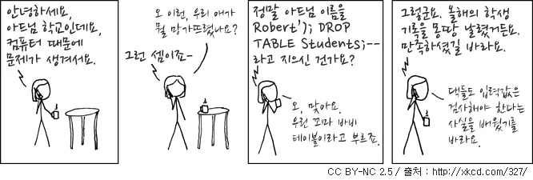
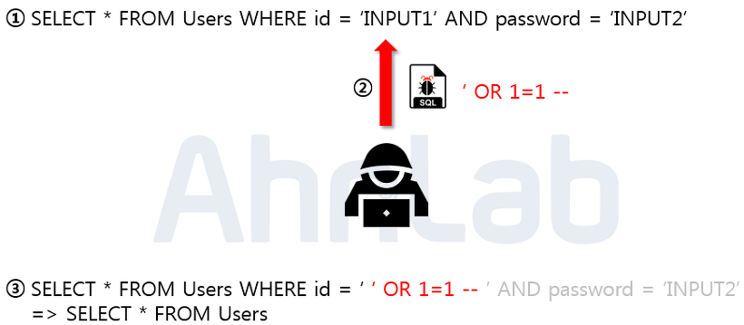
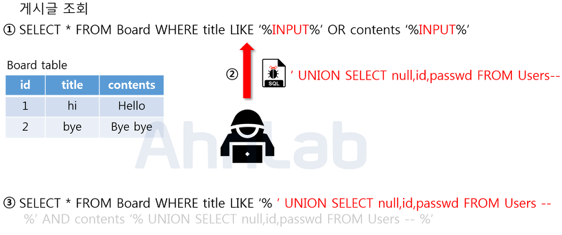
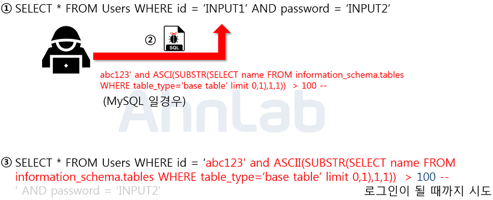
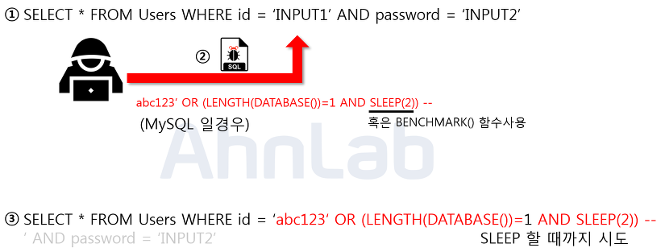

# SQL injection
## 💡 SQL Injection 이란?

공격자가 악의적인 의도를 갖는 SQL 쿼리를 주입하고 실행하여 데이터베이스를 비정상적으로 조작하는 공격 기법이다. 주로 개인정보를 탈취하거나 데이터를 변경할 때 많이 사용된다.

 

### SQL injection 의 종류

악의적인 사용자는 입력값에 대한 적절한 유효성 검사가 이루어지지 않는 경우, 입력 데이터에 SQL 명령어를 포함하여 전송할 수 있다.

 

논리적 에러를 이용한 SQL Injection (Error based SQL Injection)

 
논리적 에러를 이용한 SQL injection 은 가장 많이 쓰이고 대중적인 공격 기법이다. 주로 로그인 시 많이 사용된다.

 

`‘ OR 1=1 --` 로 WHERE 절에 있는 싱글쿼터를 닫아주기 위한 싱글쿼터와 `OR 1=1` 라는 구문을 통해 WHERE 절을 모두 참으로 만들고, `--` 를 사용해 뒤의 구문을 주석 처리 해주었다.
즉, Users 테이블에 있는 모든 정보를 조회할 수 있게 되어 가장 먼저 만들어진 계정으로 로그인에 성공하게 된다. 보통 관리자 계정을 맨 처음 만들기 때문에 관리가 계정에 로그인하게 되어 2차 피해를 발생시킬 수 있게 된다.

Union 명령어를 이용한 SQL Injection (Union based SQL Injection)

 
SQL에서 Union 키워드는 두 개의 쿼리문에 대한 결과를 통합해서 하나의 테이블로 보여주게 하는 것이기 때문에 Union 키워드를 이용해 injection 에 성공하면, 원하는 쿼리문을 실행할 수 있게 된다.

 

Union 키워드와 함께 컬럼 수를 맞춰서 SELECT 구문을 넣어주게 되면 두 쿼리문이 합쳐져 하나의 테이블로 보이게 되고, 사용자의 개인정보가 게시글과 함께 보여지게 된다.

Blind SQL Injection (Boolean SQL Injection)

 
Blind SQL Injection 은 데이터베이스로부터 특정한 값이나 데이터를 전달받지 않고, 단순히 참과 거짓의 정보만 알 수 있을 때 사용한다.

 

공격자는 위와 같은 프로세스를 자동화 스크립트를 통해 반복하여 단기간 내에 테이블 명을 알아낼 수 있다.

Blind SQL Injection (Time Based SQL Injection)

 
마찬가지로 특정한 응답 대신 참 혹은 거짓의 응답을 통해 데이터베이스의 정보를 유추하는 기법이다. 사용되는 함수는 MySQL 기준으로 SLEEP 과 BENCHMARK 이다.

 

위의 프로세스를 통해 현재 사용하고 있는 데이터베이스의 길이를 알아낼 수 있다.

Stored Procedure SQL Injection

 
일련의 쿼리들을 모아 하나의 함수처럼 사용하기 위한 것이다. 공격자가 시스템 권한을 획득해야 하기 때문에 공격 난이도가 높으나, 공격에 성공한다면 서버에 직접적인 피해를 입힐 수 있는 공격이다.

Mass SQL Injection

 
기존의 SQL Injection 과 달리 한 번의 공격으로 다량의 데이터베이스가 조작되어 큰 피해를 입히는 것을 의미한다. 보통 데이터베이스 값을 변조하여 데이터베이스에 악성 스크립트를 삽입하고, 사용자들이 변조된 사이트에서 접속 시 좀비 PC 로 감염이 되게 한다. 이렇게 감염된 좀비 PC들은 DDos 공격에 사용된다.

 

- - -

## 💡 SQL Injection 대응 및 방어 방법

### 입력값 검증

입력값에 대한 검증을 수행하여 SQL Injection 을 방지할 수 있다. 입력값에 SQL 명령어가 포함되지 않도록 필터링하고, 정규 표현식을 사용하여 입력값을 검증하는 것이 좋다.

### Prepared Statement 구문 사용

사용자의 입력값이 데이터베이스의 파라미터로 들어가기 전에 DBMS가 미리 컴파일하여 실행하지 않고 대기한다. 그 후, 사용자의 입력값을 문자열로 인식하게 하여 공격쿼리가 들어간다고 공격자의 의도대로 전체 쿼리문이 작동하지 않는다.

### Error Message 감추기

데이터베이스 에러 발생 시 따로 처리를 해주지 않았다면 에러가 발생한 쿼리문과 함께 관련 내용을 반환해준다. 공격자가 SQL Injection 을 수행하기 위해서는 데이터베이스의 정보가 필요한데, 에러 메시지를 보여주지 않는다면 추가 정보를 얻어낼 수 없게 된다.

### Least Privilege 원칙 적용

데이터베이스 사용자에게는 최소한의 권한만을 부여하여 SQL Injection 공격을 줄일 수 있다.

### Stored Procedure 사용

Stored Procedure 는 SQL 쿼리를 미리 컴파일하여 실행 계획을 수립한 후, 필요한 매개변수만 전달받아 실행하기 때문에 쿼리가 컴파일되고 최적화되어 SQL Injection 을 방지할 수 있다. Stored Procedure 를 사용하면 쿼리에 대한 입력값 검증 및 필터링을 자동으로 수행할 수 있기 때문에 쿼리문 자체에 대한 보안을 쉽게 구현할 수 있다.

### Escape 사용

Escape 문자를 사용해 특수 문자를 필터링하여 공격을 방지할 수 있다.

 

- - -
## 💡 면접 대비 질문

- SQL Injection 이 무엇인가요?
- SQL Injection 방어 및 방지하기 위한 방법에 대해 알고 있다면 설명해주세요.
- Prepared statement와 Stored Procedure는 SQL injection을 어떻게 방지할까요?
    

    
✔️ Answer

     

    `Prepared Statement` 는 SQL 문장과 데이터를 분리하여 작성한다. 즉, SQL 문장과 데이터를 따로 전송하고 서버에서는 SQL 문장을 미리 컴파일하여 실행 계획을 수립한 후, 데이터를 매개변수로 전달받아 실행한다. 이를 통해 입력값에 대한 검증이 수행되며, 입력값에 SQL 명령어를 포함해도 실제로 실행되지 않게 된다.

     

    `Stored Procedure` 는 SQL 쿼리를 미리 컴파일하여 실행 계획을 수립한 후, 필요한 매개변수만 전달받아 실행한다. Stored Procedure를 사용하면, SQL 쿼리에 대한 입력값 검증 및 필터링을 자동으로 수행할 수 있다.

     
    즉, Prepared statement와 Stored Procedure를 적절하게 사용하면, SQL injection을 방지할 수 있다.

    

 

- - -

> 👉 참고 
> https://noirstar.tistory.com/264
> https://velog.io/@yanghl98/Database-SQL-Injection
> https://namu.wiki/w/SQL%20injection
