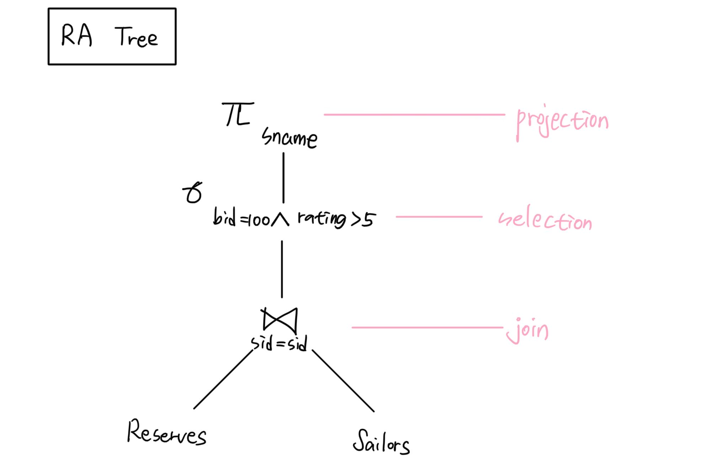
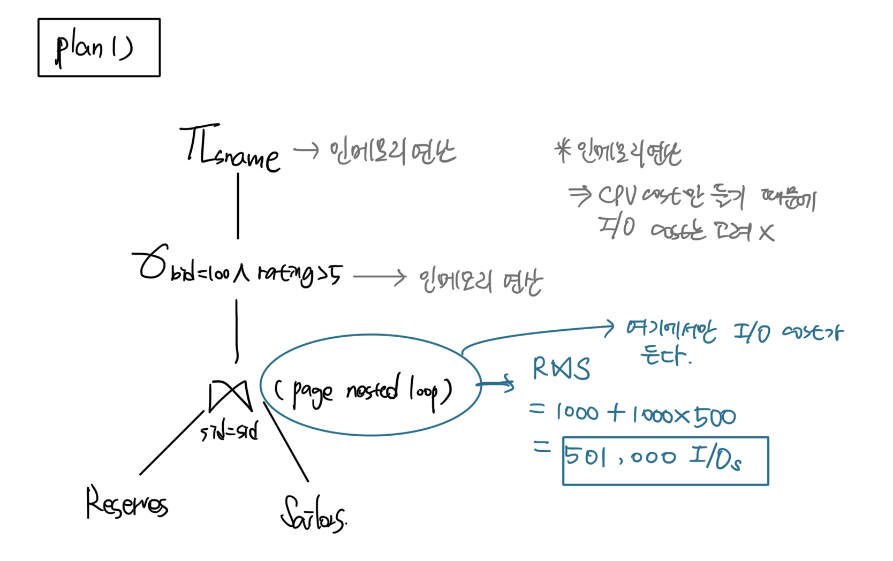
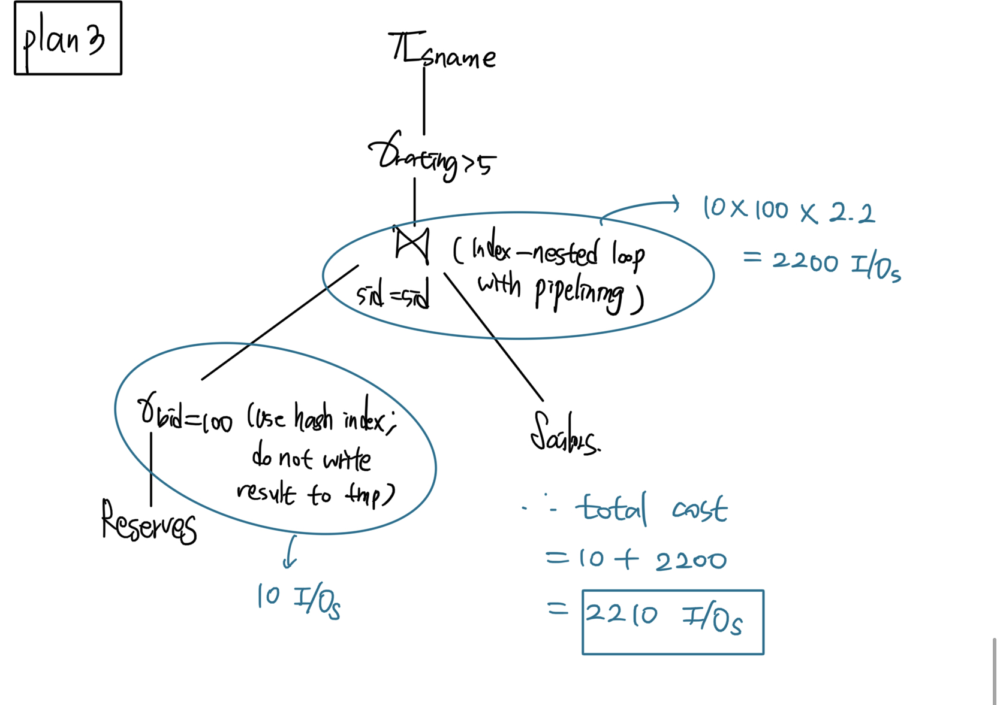

# 옵티마이저(Optimizer)란?

## 💡옵티마이저(Optimizer)

쿼리의 결과는 동일하지만 내부적으로 그 결과를 만들어내는 방법은 매우 다양합니다.   
그런 방법 중에서 어떤 방법이 최적이고 최소의 비용이 소모될 지 결정해야 합니다.   

쿼리를 최적으로 실행하기 위해 각 테이블의 데이터가 어떤 분포로 저장돼 있는지를 참조하고,   
데이터를 기반으로 최적의 실행 계획을 수립해주는 것이 **옵티마이저**입니다.   

어떤 DBMS든 쿼리의 실행 계획을 수립하는 옵티마이저는 가장 복잡한 부분으로 알려져있습니다.   
하지만, 실행 계획을 이해해야 실행 계획의 불합리한 부분을 찾아내고,   
더 최적화된 방법으로 실행 계획을 수립하도록 유도할 수 있습니다.   


## 💡Overview of Query Evaluation

* SQL --> (compile by SQL compiler) ——> Query Plan
  * Query Plan ?
    * SQL 질의를 처리할 때 (관계대수의 연산자로 이루어진) tree를 만들고, 그 각각의 연산자들에 대해서 어떤 알고리즘을 쓸 지 정합니다
    * 관계대수 연산자들로 이루어진 tree 인데 그 각각의 관계대수 연산자를 어떻게 구현할건지 그 알고리즘까지 포함하는 게 하나의 query plan 입니다
    * 하나의 SQL 질의에 대해 여러 query plan들이 만들어질 수 있습니다
  * Query Optimization에서 중요한 두 가지 이슈
    * SQL 질의 처리 시 가장 중요한 것 - 최적화를 시키는 것
    * query optimization?
      * SQL 질의 처리 시 I/O 비용을 최소화시키는 것
    * Issue 1
      * 해당 쿼리문에서 어떤 plan들이 고려될 수 있는지
    * Issue 2
      * plan의 cost를 어떻게 산정할 것인지

* 이상적으로는 find the best plan이지만 현실적으로는 불가능 (NP 문제임)
* 현실적으로는 worst plan을 피하는 것이다


## 💡쿼리 실행 절차

MySQL 서버에서 쿼리가 실행되는 과정은 크게 세 단계로 나눌 수 있습니다.   

1. SQL문을 잘게 쪼개서 MySQL Server가 이해할 수 있는 수준으로 분리(파스 트리)한다. - 파싱단계
2. SQL의 파싱 정보(파스 트리)를 확인하면서 어떤 테이블부터 읽고 어떤 인덱스를 이용할 지 선택한다.   
3. 2번째 단계에서 결정된 테이블의 읽기 순서나 선택된 인덱스를 이용해 Storage Engine에서 데이터를 가져온다.    

MySQL Server가 실제로 쿼리를 실행할 때는 SQL 문장이 아니라 SQL 파스 트리를 사용해서 쿼리를 실행합니다

두 번째 단계는 첫 번째 단계에서 만들어진 SQL 파스 트리를 참조해서 다음의 내용을 처리합니다   
* 불필요한 조건 제거 및 복잡한 연산의 단순화
* 여러 테이블의 조인이 있는 경우 어떤 순서로 테이블을 읽을지 결정
* 각 테이블에 사용된 조건과 인덱스 통계 정보를 이용해 사용할 인덱스를 결정
* 가져온 레코드들을 임시 테이블에 넣고 다시 한번 가공해야 하는지 결정

물론 이 밖에도 수많은 처리를 합니다 해당 단계는 최적화 및 실행 계획 수립 단계이며, MySQL Server의 Optimizer에서 처리합니다   

세번째 단계는 수립된 계획대로 스토리지 엔진에서 레코드를 읽어오도록 요청하고, MySQL 엔진에서는 스토리지 엔진으로부터 받은 레코드를 조인하거나 정렬하는 작업을 수행합니다   

첫번째, 두번째 단계는 주로 MySQL 엔진에서 처리하며, 세 번째 단계는 MySQL 엔진과 스토리지 엔진이 함께 처리합니다   


## 💡예시

```sql
SELECT S.sname
FROM Reserves R, Sailors S
WHERE R.sid = S.sid AND
	R.bid = 100 AND S.rating > 5
```

* 관계대수 tree 만들기



* 이 RA tree를 기반으로 Query plan들을 만들기
* query plan = RA tree + with choice of algorithm for each operation  


* plan1 - page nested loop algorithm
  

* plan2 - sort merge join algorithm
  

* plan3 - index nested loop algorithm
  


> ### 결론
> 처리 순서가 바뀌어도 결과는 같다, but I/O cost는 다르다


## 💡옵티마이저의 종류

옵티마이저는 크게 두 가지로 나눌 수 있다.   

### 규칙 기반 최적화
* 대상 테이블의 레코드 건수나 선택도 등을 고려하지 않고 Optimizer에 내장된 우선순위에 따라 실행 계획을 수립
* 통계 정보를 참조하지 않기 때문에 같은 쿼리에 대해서 같은 실행 계획을 만든다.
* 초기 버전의 오라클 DBMS에서 많이 사용했다.
* 사용자의 데이터는 분포도가 매우 다양하기 때문에 현재로써는 많은 DBMS에서 사용하지 않는다.

### ⭐비용 기반 최적화⭐️
* 쿼리를 처리하기 위한 여러 방법을 만들고, 각 단위 작업의 비용 정보와 대상 테이블의 통계 정보를 이용해서 각 실행 계획의 비용을 산출한다
* 산출된 정보를 이용해서 가장 적은 비용이 드는 실행 계획을 선택해서 쿼리를 실행한다
* 현재는 대부분의 RDBMS가 채택하고 있으며, MYSQL도 마찬가지이다


## 💡기본 데이터 처리

1- 풀 테이블 스캔   
2- 풀 인덱스 스캔   

* mysql 옵티마이저는 다음의 조건에 해당할 때 주로 풀 테이블 스캔을 선택한다
  * 테이블의 레코드 건수가 너무 작아서 인덱스를 통해 읽는 것보다 풀 테이블 스캔을 하는 편이 더 빠른 경우
  * WHERE 절이나 ON 절에 인덱스를 이용할 수 있는 적절한 조건이 없는 경우
  * 인덱스 레인지 스캔(Range Scan)을 할 수 있어도 조건에 일치하는 레코드가 너무 많은 경우

대부분의 DBMS는 풀 테이블 스캔을 실행할 때 한꺼번에 여러 개의 블록이나 페이지를 읽어오는 기능을 내장하고 있습니다