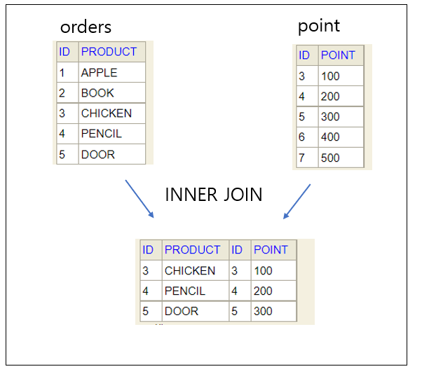
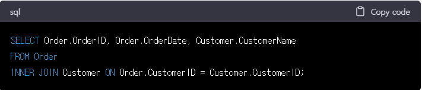

### 관계 대수 연산자의 종류
관계대수란? 
관계형 데이터베이스에서 원하는 정보와 그 정보를 검색하기 위해서 어떻게 유도하는 가를 기술하는 절차적인 언어
#### 일반 집합 연산자 : 합집합, 교집합, 차집합, 카티션 프로덕트

#### 순수 관계 연산자 : 셀렉트, 프로젝트, 조인, 디비전

### 조인이란?
공통 속성을 이용해 릴레이션 R과 S의 투플들을 연결하여 만들어진 새로운 투플들을 반환
조인의 결과는 Cartesion Product(교차곱)을 수행한 다음 Select를 수행한 것과 같다  

  
보통 조인이라 하면 내부 조인(Inner Join)을 의미 

 

* 내부 조인(Inner Join)
두 개의 테이블에서 공통된 값을 가진 행만 가져옵니다. 
조인 조건에 맞는 행만 출력되기 때문에 출력 결과가 두 테이블에서 공통적으로 가지고 있는 값만 나타납니다. 
내부 조인을 수행할 때는 일반적으로 ON 또는 USING 절을 사용합니다. 
* 외부 조인(Outer Join)
두 개의 테이블에서 일치하지 않는 값을 포함해 모든 값을 가져옵니다. 
하나의 테이블에는 존재하지만 다른 테이블에는 존재하지 않는 데이터도 결과에 포함됩니다. 
외부 조인은 LEFT JOIN, RIGHT JOIN, FULL OUTER JOIN 등의 종류가 있습니다. 
* 교차 조인(Cross Join)
두 개의 테이블에서 모든 조합의 값을 가져옵니다. 
교차 조인을 수행하면 행 수가 기하급수적으로 증가하므로 사용 시 주의해야 합니다. 
* 셀프 조인(Self Join)
하나의 테이블에서 자신과 자신을 조인합니다. 
일반적으로 부모-자식 관계나 계층 구조 등에서 사용됩니다. 
각 조인 종류는 각기 다른 상황에서 사용될 수 있으며, 조건에 따라 적합한 조인을 선택해야 합니다.  
  
  
* 순수 관계 연산자 – 세타 조인(theta join, 𝜽-join)  
** 기능 
• 주어진 조인 조건을 만족하는 두 릴레이션의 모든 투플을 연결하여
생성된 새로운 투플로 결과 릴레이션을 구성 
• R ⋈A𝜃B S ＝ { r · s | r∈R ∧ s∈S ∧ (r.A 𝜽 s. B) } 
– A, B : 조인 속성
– 𝜽는 비교 연산자(>, ≥, <, ≤, =, ≠)를 의미  
** 결과 릴레이션의 차수 : 두 릴레이션의 차수를 더한 것과 같음

* 조인(join) 혹은 자연조인  
자연조인은? 
조인 조건이 '='일 때 동일한 속성이 두 번 나타나게 되는데, 이중 중복된 속성을 제거하여 같은 속성을 한 번만 표기하는 방법  
** 기능 
• 조인 속성을 이용해 두 릴레이션을 조합하여 결과 릴레이션을 구성 
– 조인 속성의 값이 같은 투플만 연결하여 생성된 투플을 결과 릴레이션에 포함 
– 조인 속성 : 두 릴레이션이 공통으로 가지고 있는 속성 
– 동일조인의 결과 릴레이션에서 중복 속성을 제거한 결과와 동일함  
• R ⋈N S = 𝜋 X∪Y(σZ=Z (RS)) = 𝜋 X∪Y(R ⋈ Z=Z S)) 
– R(X), S(Y)의 조인 속성 : Z(=X∩Y)  
** 대상 
• 두 개의 릴레이션

##References
[블로그 레퍼런스1](https://advenoh.tistory.com/23)
[블로그 레퍼런스2](https://velog.io/@ragnarok_code/DataBase-%EC%A1%B0%EC%9D%B8Join%EC%9D%B4%EB%9E%80)
[시나공 정보처리기사]
