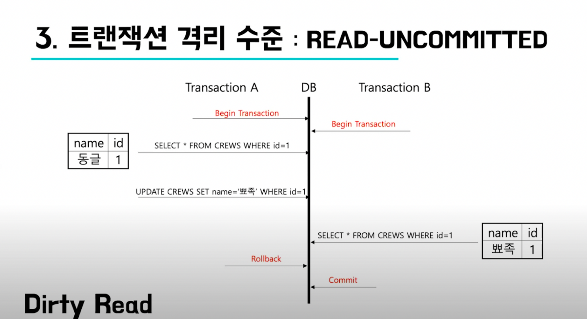
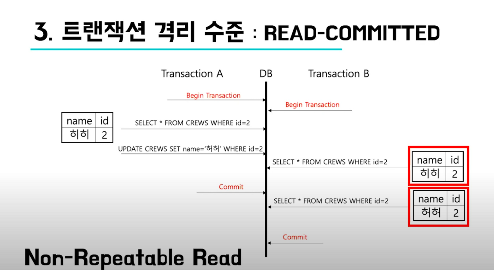
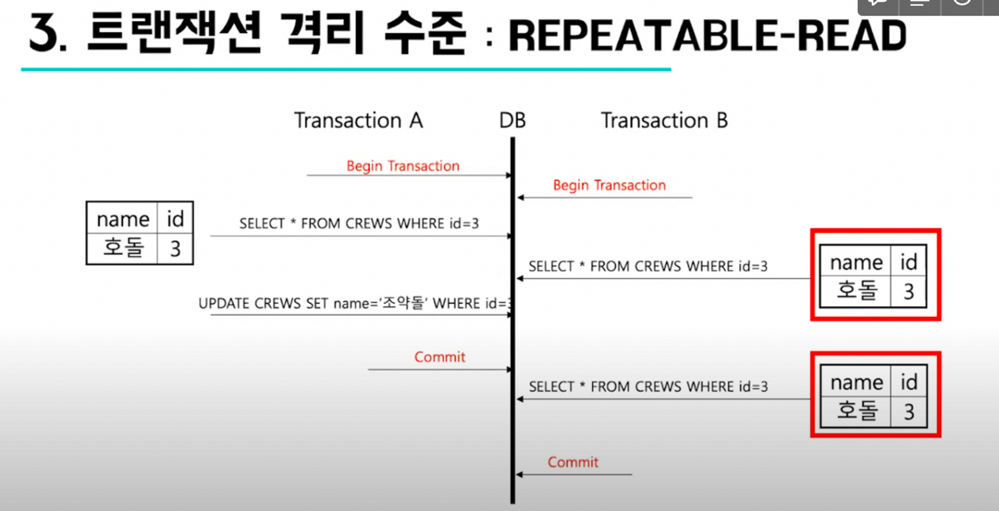
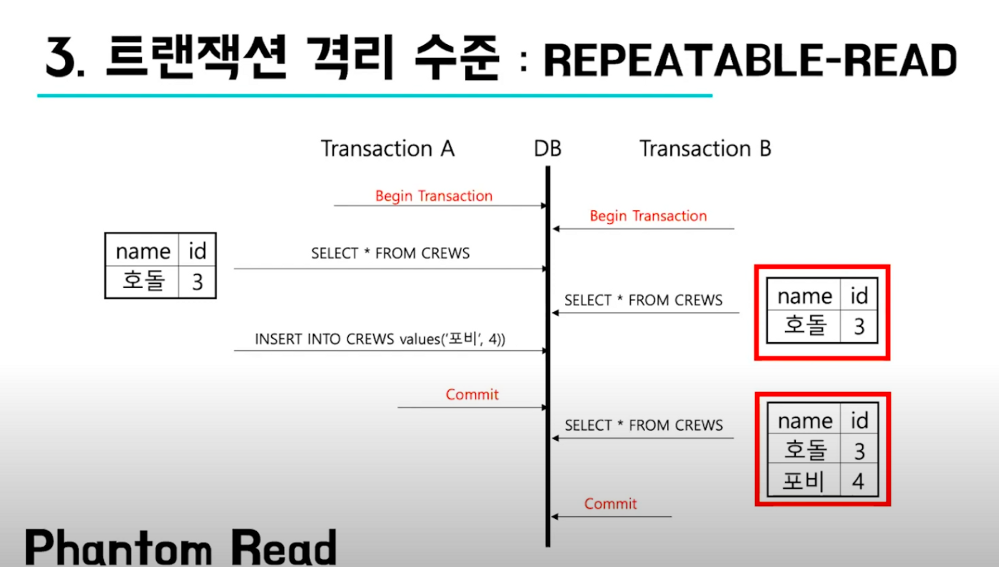
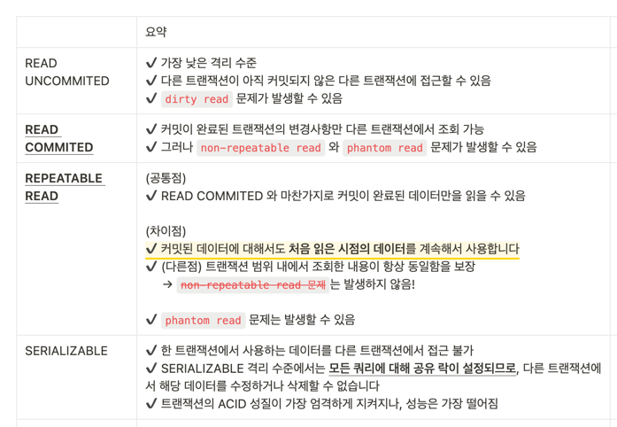
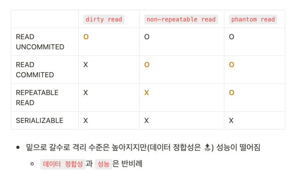

# 트랜잭션 격리 수준 (Transaction Isolation Level)

* 여러 트랜잭션이 같은 데이터를 동시에 읽고 쓸 때에는 수 많은 동시성 문제가 발생할 수 있습니다
* 트랜잭션 격리 수준은 이러한 동시성 문제를 해결하기 위해 도입되었으며,   
  여러 트랜잭션이 동시에 실행됐더라도 그 결과가 트랜잭션이 순차적으로 실행됐을때의 결과와 동일함을 보장한다 를 의미합니다

## 💡종류

* READ UNCOMMITED
* READ COMMITED
* REPEATABLE READ
* SERIALIZABLE


✔️ 밑으로 갈수록 격리 수준은 높아지지만 (데이터 정합성 🔝) 성능이 떨어짐     
✔️ ```데이터 정합성```과 ```성능```은 반비례


## 💡READ UNCOMMITED

* 가장 낮은 격리 수준
* 다른 트랜잭션이 아직 커밋되지 않은 다른 트랜잭션에 접근할 수 있습니다
  * 이 때문에 ```dirty read``` 와 같은 문제가 발생할 수 있습니다
    * ```dirty read ?```
      * dirty read 는 다른 트랜잭션이 아직 커밋하지 않은 데이터를 읽었을 때, 그 데이터가 롤백될 가능성이 있어, **읽은 데이터가 실제로는 존재하지 않는 것처럼 보일 수 있는 문제**입니다.
      * 예를 들어, 트랜잭션 A가 데이터를 수정 중이고 아직 커밋하지 않은 상태에서, 트랜잭션 B가 같은 데이터를 읽는 쿼리를 실행한다면, 트랜잭션 B는 A가 아직 커밋하지 않은 데이터를 읽을 수 있습니다.
      * **하지만, 트랜잭션 A가 롤백되면, 트랜잭션 B가 읽은 데이터는 실제로는 존재하지 않는 것이므로, ```dirty read``` 문제가 발생할 수 있습니다.**
      * 
* READ UNCOMMITED 격리 수준은 다른 격리 수준에 비해 동시성 처리 성능은 높지만, **데이터의 무결성을 보장하지 않는다**는 단점이 있습니다
* 따라서, READ UNCOMMITED 격리 수준은 특별한 경우를 제외하고는 사용하지 않는 것이 좋습니다


## 💡READ COMMITED

* 커밋이 완료된 트랜잭션의 변경사항만 다른 트랜잭션에서 조회 가능
* ```non-repeatable read``` 문제가 발생할 수 있다
  * ```non-repeatable read ?```
    * 한 트랜잭션이 같은 쿼리를 두 번 실행했을 때, 서로 다른 데이터를 읽는 문제
    * 
    * 즉, 같은 트랜잭션 내에서 select 문을 두 번 조회했는데 두 값이 다른 값이 나오는 데이터 불일치 문제
* ```phantom read``` 문제가 발생할 수 있다

(추가)
* READ COMMITED 만 사용하더라도 Dirty read와 Dirty write를 모두 막아주므로 **트랜잭션의 미완료 결과를 읽는 것을 방지**하고, **동시에 실행되는 쓰기가 섞이는 것을 막아줍니다**
* 실제로 READ COMMITED 만 사용해도 많은 동시성 문제를 DB단에서 해결할 수 있습니다
* 하지만, 커밋 후 읽기 격리 수준으로도 해결할 수 없는 동시성 문제들이 아직 많이 존재합니다


## 💡REPEATABLE READ

* READ COMMITED 와 마찬가지로 커밋이 완료된 데이터만을 읽을 수 있음

(차이)
* 커밋된 데이터에 대해서도 처음 읽은 시점의 데이터를 계속해서 사용하여, 트랜잭션 범위 내에서 조회한 내용이 항상 동일함을 보장합니다
* **같은 쿼리를 실행하더라도 일관된 결과를 보장합니다**
   -> ~~non-repeatable read 문제~~는 발생하지 않음
  *    


* ```phantom read``` 문제는 발생할 수 있음
  * ```non-repeatable read``` 의 한 종류로 select 문을 쓸 때 나타날 수 있는 현상
  * 해당 쿼리로 읽히는 데이터에 들어가는 행이 새로 생기거나 없어져 있는 현상
  * 


## 💡SERIALIZABLE

 * 한 트랜잭션에서 사용하는 데이터를 다른 트랜잭션에서 접근 불가
 * SERIALIZABLE 격리 수준에서는 **모든 쿼리에 대해 공유 락이 설정되므로**, 다른 트랜잭션에서 해당 데이터를 수정하거나 삭제할 수 없습니다
 * 트랜잭션의 ACID 성질이 가장 엄격하게 지켜지나, 성능은 가장 떨어짐


---

## 💡요약



