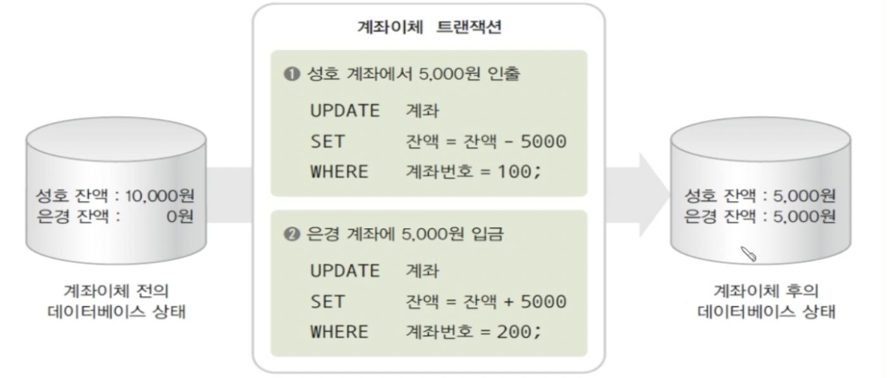

## Index

- [트랜잭션(Transaction)](#트랜잭션(Transaction))

- [트랜잭션의 역할](#트랜잭션의-역할)

- [트랜잭션의 특성](#트랜잭션의-특성)

- [트랜잭션의 주요 연산](#트랜잭션의-주요-연산)

- [트랜잭션의 상태](#트랜잭션의-상태)

- [References](#References)

---

## 트랜잭션(Transaction)

데이터베이스의 상태를 변화시키기 위해 수행하는 작업의 단위

- `데이터베이스의 상태 변화` : 아래의 질의어(SQL)를 이용하여 데이터베이스에 접근하는 것을 의미함.
- `질의어` : SELECT, INSERT, DELETE, UPDATE
- 작업의 단위는 질의어 한문장일수도, 그 이상일수도 있음.
    

- 예를들어, A계좌에서 B계좌로 일정 금액을 이체한다고 가정하자.
    1. A계좌의 잔액을 확인한다.
    2. A계좌의 금액에서 이체할 금액을 빼고 다시 저장한다.
    3. B계좌의 잔액을 확인한다.
    4. B계좌의 금액에서 이체할 금액을 더하고 다시 저장한다.
- 이러한 과정들이 모두 합쳐져 계좌이체라는 하나의 작업단위(트랜잭션)를 구성함.
- 즉, 트랜잭션이란 하나의 작업을 수행하기 위해 필요한 데이터베이스의 연산(질의어)들을 모아놓은 것임.
    

## 트랜잭션의 역할

- 장애 발생 시 복구 작업이나 병행 제어 작업의 중요한 단위로 사용됨.
- 데이터베이스의 회복과 동시성 제어를 가능하게하여 데이터베이스가 일관된 상태를 유지하도록 도움.
    - `회복` : 데이터베이스에 장애가 발생하면 장애 발생 전의 상태로 되돌리는 것
    - `동시성 제어` : 다수의 트랜잭션이 동시에 처리되는 것
    - 하나의 트랜잭션에 포함된 SQL문들은 모두 실행되거나 모두 실행되지 않음.  
    따라서 트랜잭션 수행 중 장애가 발생하면 트랜잭션이 수행되기 전으로 돌아가게 되어 장애가 회복됨.

## 트랜잭션의 특성
    
트랜잭션은 4가지 특성을 가지며 각각의 앞글자를 따서 `ACID 특성`이라고 불림.

1. 원자성(Atomicity)  
    트랜잭션의 연산들이 모두 정상적으로 실행되거나 하나도 실행되지 않아야 한다.   
    만약 트랜잭션 단위로 데이터가 처리되지 않는다면, 데이터 처리 시스템을 이해하기 힘들 뿐만아니라 오작동 시 원인 발견이 어려워진다.

2. 일관성(Consistency)  
    트랜잭션이 성공적으로 수행된 후에도 데이터베이스가 일관성 있는 상태를 유지해야 한다.  
    트랜잭션이 진행되는 동안에 데이터베이스가 변경되도라도 처음에 트랜잭션을 진행하기 위해 참조한 데이터베이스로 진행되어 사용자는 일관성 있는 데이터를 볼 수 있다. (ex 계좌이체 전후에 계좌 잔액 합이 유지됨)

3. 격리성(Isolation)  
    수행중인 트랜잭션이 완료될 때까지 다른 트랜잭션들이 중간 연산 결과에 접근 및 참조할 수 없다.

4. 지속성(Durability)  
    트랜잭션이 성공적으로 완료되었을 경우, 그 결과가 영구적으로 반영되어야 한다.

## 트랜잭션의 주요 연산

- commit 연산  
    - 트랜잭션의 수행이 성공적으로 완료되었음을 선언하는 연산임.  
    - commit 연산이 수행되면 트랜잭션의 수행 결과가 데이터베이스에 반영되고 일관된 상태를 지속적으로 유지하게 함.

- rollback 연산  
    - 트랜잭션의 수행이 실패했음을 선언하는 연산임.  
    - rollback 연산이 수행되면 지금까지 트랜잭션이 실행한 연산의 결과가 취소되고 수행 전의 일관된 상태로 데이터베이스가 되돌아가며, 해당 트랜잭션을 재시작하거나 폐기함.

## 트랜잭션의 상태
    

- 활동(Active)  
    - 트랜잭션이 수행을 시작하여 수행중인 상태

- 부분 완료(Partially Committed)  
    - 트랜잭션의 마지막 연산이 실행을 끝낸 직후, commit 연산이 실행되기 직전의 상태

- 완료(Committed)  
    - 트랜잭션이 성공적으로 완료되어 commit 연산을 실행한 상태  
    - 데이터베이스가 새로운 일관된 상태가 되면서 트랜잭션이 종료됨.

- 실패(Failed)  
    - 장애가 발생하여 트랜잭션의 수행이 중단된 상태

- 철회(Aborted)  
    - 트랜잭션이 수행을 실패하여 rollback 연산을 실행한 상태  
    - 지금까지 실행한 트랜잭션의 연산을 모두 취소하고 데이터베이스를 되돌리면서 트랜잭션이 종료됨.

## References

[깃허브 레퍼런스1](https://github.com/gyoogle/tech-interview-for-developer/blob/master/Computer%20Science/Database/Transaction.md)

[깃허브 레퍼런스2](https://github.com/WeareSoft/tech-interview/blob/master/contents/db.md#%ED%8A%B8%EB%9E%9C%EC%9E%AD%EC%85%98%EC%9D%B4%EB%9E%80)

[깃허브 레퍼런스3](https://github.com/shinhee-rebecca/2022-cs-study/blob/main/Database/integrity%2C%20transaction%2C%20deadlock.md#%ED%8A%B8%EB%9E%9C%EC%9E%AD%EC%85%98)

[블로그 레퍼런스1](https://mommoo.tistory.com/62)

[블로그 레퍼런스2](https://coding-factory.tistory.com/226)

[블로그 레퍼런스3](https://wonit.tistory.com/462)

[블로그 레퍼런스4](https://cocoon1787.tistory.com/808)