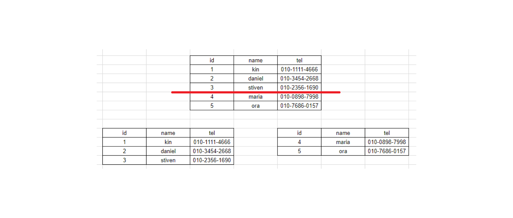
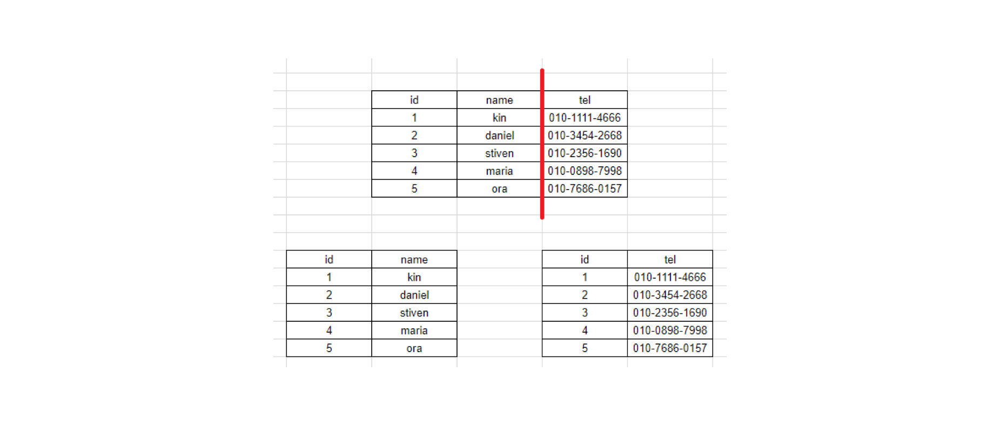

# DB 파티셔닝(Partitioning) 이란

## 배경
* 서비스의 크기가 점점 커지고 DB에 저장하는 데이터의 규모 또한 대용량화 되면서, 기존에 사용하는 DB 시스템의 용량(storage)의 한계와 성능(performance)의 저하 를 가져오게 되었다.
* 즉, 하나의 DBMS에 너무 큰 table이 들어가면서 용량과 성능 측면에서 많은 이슈가 발생하게 되었고, 이런 이슈를 해결하기 위한 방법으로 table을 ‘파티션(partition)’이라는 작은 단위로 나누어 관리하는 ‘파티셔닝(Partitioning)’기법 이 나타나게 되었다.
* ‘파티셔닝(Partitioning)’기법을 통해 소프트웨어적으로 데이터베이스를 분산 처리하여 성능이 저하되는 것을 방지하고 관리를 보다 수월하게 할 수 있게 되었다.

## 개념
* 논리적인 데이터 element들을 다수의 entity로 쪼개는 행위를 뜻하는 일반적인 용어
* 즉 큰 table이나 index를, 관리하기 쉬운 partition이라는 작은 단위로 물리적으로 분할하는 것을 의미
  * (특징) 물리적인 데이터 분할이 있더라도, DB에 접근하는 application의 입장에서는 이를 인식하지 못한다

## 목적
* 성능 (Performance)
  * 특정 DML과 Query의 성능을 향상시킨다
  * 주로 대용량 Data WRITE 환경에서 효율적이다
  * 특히, Full Scan에서 데이터 access의 범위를 줄여 성능 향상을 가져온다

* 가용성 (Availability)
  * 물리적인 파티셔닝으로 인해 전체 데이터의 훼손 가능성이 줄어들고 데이터 가용성이 향상된다
  * 각 분할 영역(partition별로)을 독립적으로 백업하고 복구할 수 있다

* 관리용이성 (Manageability)
  * 큰 table들을 제거하여 관리를 쉽게 해준다

## DB 파티셔닝의 장단점
* 장점
  * 관리적 측면 : partition 단위 백업, 추가, 삭제, 변경 
    * 전체 데이터를 손실할 가능성이 줄어들어 데이터 가용성이 향상된다.
    * partition별로 백업 및 복구가 가능하다.
    * partition 단위로 I/O 분산이 가능하여 UPDATE 성능을 향상시킨다.
  * 성능적 측면 : partition 단위 조회 및 DML수행
    * 데이터 전체 검색 시 필요한 부분만 탐색해 성능이 증가한다.
      * 즉, Full Scan에서 데이터 Access의 범위를 줄여 성능 향상을 가져온다.
      * 필요한 데이터만 빠르게 조회할 수 있기 때문에 쿼리 자체가 가볍다.

* 단점
  * table간 JOIN에 대한 비용이 증가한다
  * table과 index를 별도로 파티셔닝할 수 없다
    * table과 index를 같이 파티셔닝해야 한다

## 파티셔닝의 종류
1. 수평 파티셔닝 (Horizontal Partitioning)

수평 파티셔닝은 하나의 테이블의 각 행을 다른 테이블에 분산시키는 것이다.  
예를 들어 그림과 같이 5개의 행이 있는 테이블을 각각 3개, 2개의 행을 가진 테이블로 쪼갤 수 있다.

* 장점 
  * 데이터의 개수를 기준으로 나누어 파티셔닝한다.
  * 데이터의 개수와 인덱스의 개수가 줄어들어 성능이 향상된다.
* 단점
  * 데이터를 찾는 과정이 기존보다 복잡하므로 Latency가 증가한다.

> 참고: 샤딩(Sharding) 이란?
> 수평 파티셔닝은 **같은 데이터베이스 내에서** 하나의 큰 테이블을 쪼개 분산 저장하는 기법이다
> 샤딩은 하나의 큰 테이블을 쪼개 **각각 다른 데이터베이스에** 분산 저장하는 기법이다

2. 수직 파티셔닝 (Vertical Partitioning)

수직 파티셔닝은 테이블의 일부 열을 빼내는 형태로 분할한다.  
즉, 테이블의 칼럼을 기준으로 나누어 파티셔닝 한다.   
정규화도 수직 파티셔닝과 관련된 과정이라고 할 수 있다.  
하지만 수직 파티셔닝은 이미 정규화된 데이터를 분리하는 과정이라고 생각해야 한다.

* 장점
  * 자주 사용하는 칼럼을 분리하여 성능을 향상할 수 있다.
  * 같은 타입의 데이터가 저장되어 데이터 압축률을 높일 수 있다.
  * 조회 시 필요 없는 칼럼을 조회하지 않아도 되므로 성능상의 이점이 있다.

* 단점 
  * 데이터를 찾는 과정이 기존보다 복잡하므로 Latency가 증가한다.
