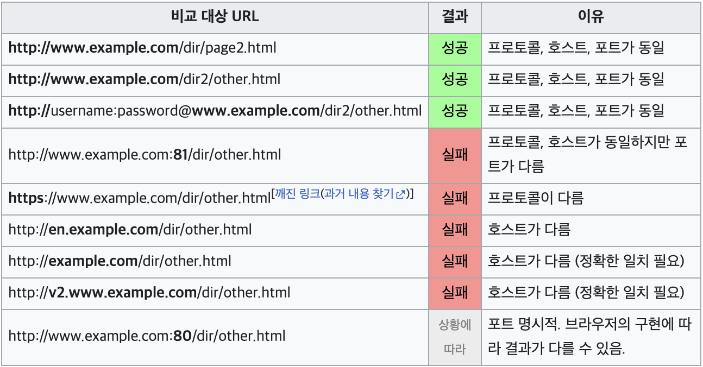
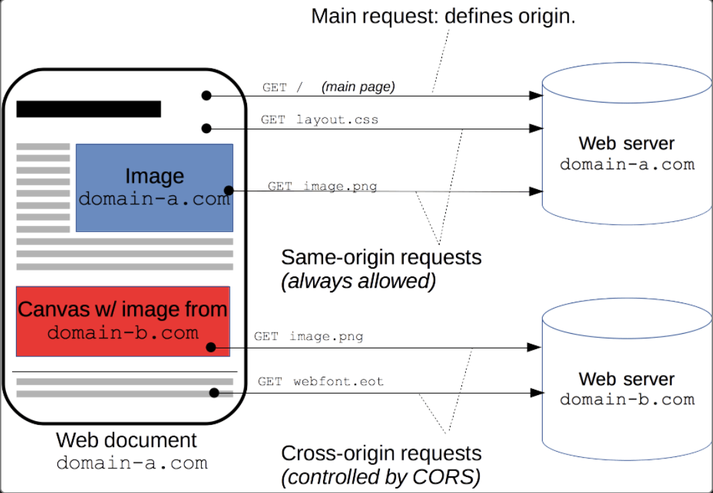

# CORS 란

 

## 💡 Sample Origin Policy (동일 출처 정책)

SOP (Same Origin Policy) 는 동일한 출처에서만 리소스를 주고 받도록 하는 정책이다.

- 여기에서 출처는 URL 주소를 의미하고, 동일한 출처는 URL 중에서도 프로토콜, 도메인 주소, 포트 번호가 같은 것의 의미

    

 

## 💡 CORS 란 무엇인가?

- CORS (Cross-Origin Resource Sharing) 는 출처가 다른 자원들을 공유한다는 뜻

- 추가 HTTP 헤더를 사용하여, 다른 출처의 자원에 접근할 수 있는 권한을 부여하도록 브라우저에 알려주는 체제

- 원래는 SOP (동일 출처 정책) 에 의해 다른 출처에서 리소스를 받아오는 것이 제한되지만, 이 문제를 해결하기 위해 CORS 를 사용하게 됨

 

### CORS 가 필요한 이유?

CORS 정책이 없고 모든 다른 출처의 데이터 요청이 가능하게 된다면, 다른 사이트에서 원래 사이트를 흉내낼 수 있게 되어 보안상의 문제가 발생할 수 있기 때문에 CORS 가 필요하다.

- 사용자가 로그인을 하도록 해, 로그인했던 세션을 탈취하여 악의적으로 정보 추출
- 다른 사람의 정보를 입력하거나 삭제하는 등의 공격이 가능

 

### 요청 방법 (Header)

CORS 요청은 요청 헤더와 응답 헤더를 통해 이루어진다.

- 단순요청 (Simple Request), 프리플라이트 요청 (Preflighted Request) 등 출처 요청 정책에 따라 다르게 CORS 요청이 된다

- 서버로 CORS 요청을 보내게 되면 서버에서 이를 확인한 후, `Access-Control-Allow-Origin` 헤더를 포함한 응답을 브라우저에 보낸다. 
  - 그 후, 브라우저는 `Access-Control-Allow-Origin` 헤더를 확인해 CORS 동작을 수행할지 판단한다.
    

    
CORS 동작 원리

     

    - `Access-Control-Request-Method` 로 실제로 보내고자 하는 메서드를 알리고,
`Access-Control-Request-Headers` 로 실제로 보내고자 하는 헤더들을 OPTIONS 메소드로 서버에 요청
    - Request와 서버 측에서 허용된 도메인 목록을 비교해 일치하면 `Access-Control-Allow-Origin` 헤더를 포함한 응답을 보내 CORS 요청이 이루어짐
    

**요청 방법**

1. Access-Control-Request-Method
     
    요청을 할 때 어떤 메소드를 사용할 것인지 알려줌

2. Access-Control-Request-Headers
     
    요청을 할 때 어떤 헤더를 사용할 것인지 알려줌

**응답 헤더**

1. **Access-Control-Allow-Origin**
     
    리소스에 접근할 수 있도록 허용하는지를 알려줌 (CORS 요청에 대한 응답)

2. Access-Control-Expose-Headers
     
    브라우저에게 접근할 수 있는 리스트들을 알려줌

3. Access-Control-Max-Age
     
    캐싱되는 시간을 알려줌

4. Access-Control-Allow-Credentials
     
    credential 이 true 일 때 요청할지에 대한 것을 알려줌

5. Access-Control-Allow-Methods
     
    허용되는 메소드를 알려줌

6. Access-Control-Allow-Headers
     
    사용 가능한 HTTP 헤더를 알려줌

 

## 💡 CORS 에러 해결 방법

서버에서 `Access-Control-Allow-Origin` 헤더를 포함하여 클라이언트의 요청에 대한 응답을 브라우저에 보내어 CORS 에러를 해결할 수 있다.

 

- - -
> 👉 참고 
> [[Network] CORS란? (feat. 보안,HTTP) (What is a CORS?)](https://fomaios.tistory.com/entry/Network-CORS%EB%9E%80-feat-%EB%B3%B4%EC%95%88HTTP)  
> [[Browser] CORS란?](https://beomy.github.io/tech/browser/cors/)  
> [교차 출처 리소스 공유 (CORS)](https://developer.mozilla.org/ko/docs/Web/HTTP/CORS)
