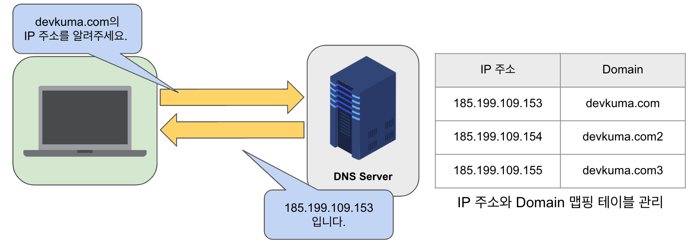
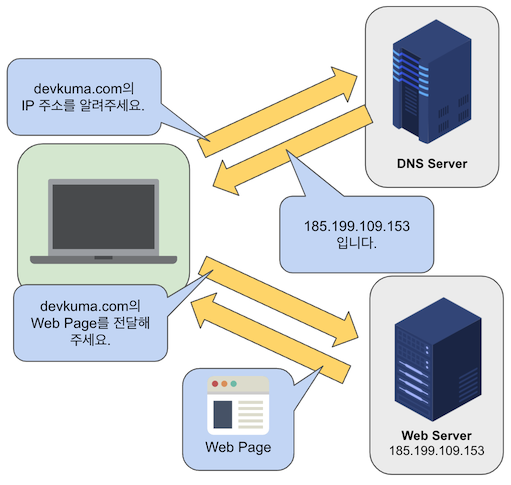
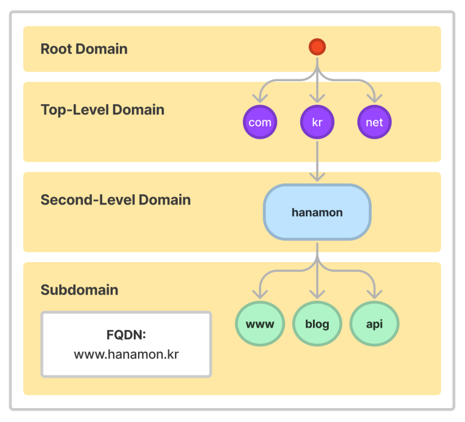
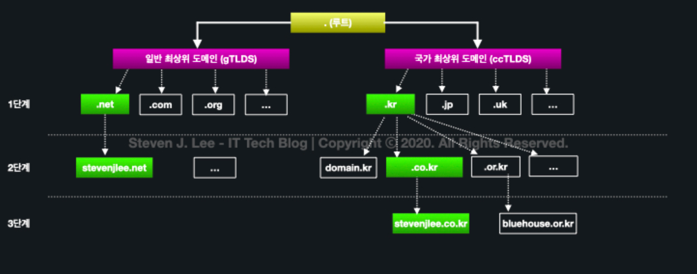
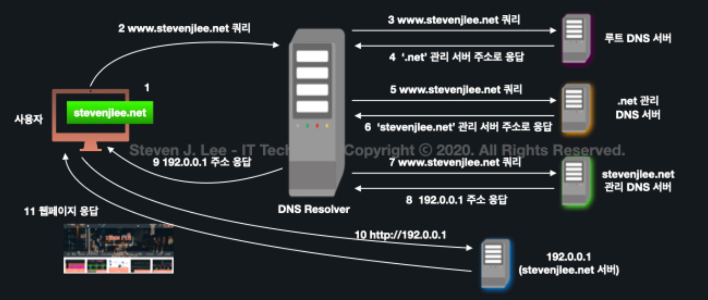
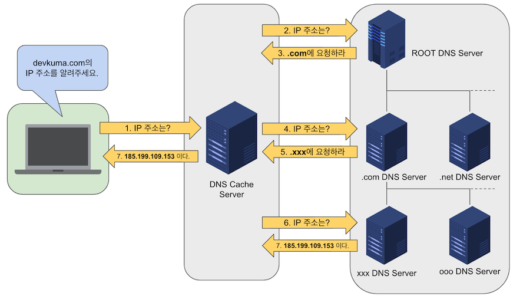

## Index

- [DNS(Domain Name System)](#DNS(Domain-Name-System))

- [DNS 구성 요소](#DNS-구성-요소)

- [DNS 구조](#DNS-구조)

- [DNS 동작 과정](#DNS-동작-과정)

- [정리](#정리)

- [References](#References)

---

 
 

## DNS(Domain Name System)

### 💡도메인(Domain)이란?
> 원래 지정된 인터넷 접속 주소를 다른 이름으로 바꾸어 준 주소

* 예를 들어, http://192.168.1.1/ 이렇게 생긴 주소를 www.이름.com 이런 식으로 바꾸어 주는 것
* 이때 www은 호스팅 주소이고 이름.com(도메인)을 도메인이라고 한다.

 

### 💡DNS란?
> 기억하기 쉬운 `도메인 이름`(예: www.amazon.com)을 컴퓨터가 인식할 수 있는 `IP 주소`(예: 192.0.2.44)로 바꾸어주는 시스템

인터넷상의 모든 컴퓨터는 숫자(`IP 주소`)를 사용하여 서로를 찾고 통신한다. 
웹 브라우저를 열고 웹 사이트로 이동할 때마다 긴 숫자(`IP 주소`)를 기억해서 입력하는 게 아니라, 
example.com과 같은 `도메인 이름`을 입력해도 원하는 웹 사이트로 이동할 수 있게 해주는 게 DNS이다. 

* 연결되어있는 IP 주소와 도메인이 저장된 곳이 DNS이다.
* 각 도메인들마다 DNS와 연결해주는 서버 역할을 하는 DNS 서버(네임서버)가 있다.

즉, 이 사진에서 IP 주소와 도메인의 맵핑 테이블을 관리하고 있는 시스템이 `DNS`이고,
DNS를 이용하여 IP 주소를 전달해주는 역할을 하는 것이 `DNS 서버`이다.

 
 

## DNS 구성 요소

1. `도메인 네임 스페이스(Domain Name Space)`
    도메인 네임 스페이스라는 규칙(방법)으로 도메인 이름을 분산하여 저장한다.
2. `네임 서버(Name Server)` = 권한 있는 DNS 서버
    네임 서버가 해당 도메인 이름의 IP 주소를 찾는다.
3. `리졸버(Resolver)` = 권한 없는 DNS 서버
    리졸버가 DNS 클라이언트 요청을 네임 서버로 전달하고 찾은 정보를 클라이언트에게 제공하는 기능을 수행한다.

 
 

## DNS 구조

“이 도메인 좀 IP 주소로 바꿔줄래?”라고 물어볼 수 있는 서버(네임서버)가 한 대만 있다면 서버 성능이나 속도 측면에서 문제가 생긴다. 
여러 서버(네임 서버)를 만든다면 정보(도메인과 IP 주소)를 모든 서버에서 공유해야 한다. 
그렇지 않으면 어떤 서버(네임 서버)에서는 어떤 도메인 이름의 IP 주소를 모른다고 할 수도 있기 때문이다. 
따라서 도메인을 계층적으로 구분하고 정보(도메인과 IP 주소)를 분산하는 구조를 이용한다. (도메인에 있는 점이 계층을 나타낸다.) 

* DNS는 전세계적인 거대한 분산 시스템이다.
* 도메인 네임 스페이스는 이러한 DNS가 저장 및 관리하는 계층적 구조를 의미한다.

1. 루트 도메인 바로 아래의 단계를 `1단계 도메인` 또는 `최상위 도메인`(TLD : Top Level Domain)이라고 한다. 
최상위 도메인은 다시 `일반 최상위 도메인`(gTLD : Generic Top Level Domain)과 `국가 최상위 도메인`(ccTLD : Country Code Top Level Domain)으로 구분할 수 있다. 
`www.example.co.kr`이라는 주소에서는 `.kr` 부분이 여기에 해당한다. 
2. 최상위 도메인 다음 단계를 `2단계 도메인`(SLD : Second Level Domain)이라고 한다. 
`www.example.co.kr`이라는 주소에서는 `.co` 부분이 여기에 해당한다. 
3. 2단계 도메인 다음 단계를 `3단계 도메인`이라고 하며 주로 도메인명이 위치한다. 
`www.example.co.kr`이라는 주소에서는 `example` 부분이 여기에 해당한다. 
4. `www.example.co.kr`에서 `www`는 호스트명으로 부른다. 또한 주소 체계와 구조에 따라 추가적인 하위 도메인 계층이 있을 수 있다. 
예를들어 mail.example.co.kr등이 있으며, 이 단계를 `4단계 도매인` 또는 `서브 도메인`이라고 한다. 
 
위와 같은 수평/수직적인 계층 구조를 통해 체계적인 주소 관리가 가능하다. 
또한 계층적 구조를 바탕으로 각 서버들이 트래픽을 나누어 처리할 수 있기 때문에 분산 처리가 가능해진다.

 
 

## DNS 동작 과정

클라이언트가 DNS 서버에 도메인 주소의 IP 주소를 물어보고 이에 대한 답을 받는 과정을 `쿼리(Query)`라고 한다. 
계층 구조로 이루어진 여러 DNS 서버들 간 몇 차례의 요청과 응답을 받게 되는데, 이 쿼리 과정은 `재귀적 쿼리(Recursive Qurey)라고 한다. 

`www.stevenjlee.net`의 DNS 처리 과정을 살펴보자.

1. 사용자가 클라이언트 호스트의 웹 브라우저에 `www.stevenjlee.net`을 입력한다.
2. 클라이언트의 호스트에 설정된 기본 DNS 서버(DNS Resolver)로 `www.stevenjlee.net`의 IP 주소를 물어본다.
    * 클라이언트가 DNS 서비스에 직접 쿼리를 수행하는 것이 아니라, 중간자 역할을 하는 DNS Resolver가 재귀적 쿼리를 수행한다.
    * DNS Resolver는 자주 요청되는 질의에 대해 일정 시간동안 해당 정보를 저장해두었다가 같은 요청이 들어올 경우 바로 답변을 해주는 캐싱(Cache) 기능도 제공한다.
3. DNS Resolver에 `www.stevenjlee.net`의 IP 주소 값이 있다면, 바로 클라이언트에게 해당 IP 주소 값을 반환한다. 
IP 주소 값이 없다면 루트 DNS 서버에 다시 IP 주소 확인 요청을 보낸다.
4. 루트 DNS 서버는 `.net`을 관리하는 1단계 DNS 서버의 IP 주소를 알려준다.
5. ~
6. `.net`을 관리하는 1단계 DNS 서버는 `stevenjlee.net`을 관리하는 2단계 DNS 서버의 IP 주소를 알려준다.
7. ~
8.  `stevenjlee.net`을 관리하는 2단계 DNS 서버는 호스팅 영역에서 `www.stevenjlee.net`의 레코드를 찾아 IP 주소 값을 받고, 이 IP 주소를 다시 DNS Resolver로 보낸다.
9. DNS Resolver가 웹 브라우저에게 `www.stevenjlee.net`의 IP 주소를 알려준다.
10. ~
11. 웹 브라우저는 IP 주소로 해당 서비스에 접속하여 서비스를 웹 브라우저에 표시한다.
 
 

## 정리

* 숫자(IP 주소)가 아니라 알기 쉽게 문자(도메인 이름)로 표기하려고 하는 것이 DNS의 목적!
* 1대의 서버로 모든 것을 관리하는 것이 아니라, 서버를 계층화해서 분산하여 “도메인명"과 “IP 주소"의 맵핑을 관리한다!

* 웹 브라우저에 URL을 입력하면 브라우저가 이 요청을 DNS 서버로 전달한다.
* DNS 서버에 URL의 IP 주소가 캐싱된 경우 해당 정보가 브라우저로 다시 전달된다.
* 그렇지 않은 경우 요청은 DNS 루트 이름 서버, TLD(상위 레벨 도메인) 서버로 차례로 이동한 다음 마지막으로 권한 DNS 마스터 루트 서버로 이동한다.
* 위 서버 중 하나에서 IP 주소를 찾으면, 즉시 웹 브라우저로 다시 전달되어 해당 웹사이트가 표시된다.

 
 

## References

[DNS 계층 & 동작과정](https://www.stevenjlee.net/2020/07/08/%EC%9D%B4%ED%95%B4%ED%95%98%EA%B8%B0-dns-domain-name-server/)

[DNS 서버](https://www.devkuma.com/docs/dns/)

[DNS 구성 요소](https://hanamon.kr/dns%EB%9E%80-%EB%8F%84%EB%A9%94%EC%9D%B8-%EB%84%A4%EC%9E%84-%EC%8B%9C%EC%8A%A4%ED%85%9C-%EA%B0%9C%EB%85%90%EB%B6%80%ED%84%B0-%EC%9E%91%EB%8F%99-%EB%B0%A9%EC%8B%9D%EA%B9%8C%EC%A7%80/)

[DNS 동작 과정](https://aws.amazon.com/ko/route53/what-is-dns/)