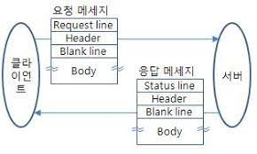
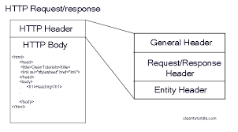

## Index

- [HTTP 헤더](#HTTP-헤더)

- [HTTP General header](#HTTP-General-header)

- [HTTP Request header](#HTTP-Request-header)

- [HTTP Response header](#HTTP-Response-header)

- [HTTP Entity header](#HTTP-Entity-header)

- [References](#References)

---

## HTTP 헤더

- HTTP 프로토콜의 요청과 응답은 `헤더`(header, 부가 정보)와 `바디`(body, 실제 데이터)로 구성됨

- HTTP 헤더는 클라이언트와 서버가 요청 또는 응답으로  부가적인 정보(요청자, 컨텐트 타입, 캐싱 등)를 전송할 수 있도록 해줌.

- HTTP 헤더는 `공통 헤더`, `요청 헤더`, `응답 헤더`, `엔티티 헤더`로 구분됨

 

## HTTP General header
 요청과 응답 모두에 사용되지만 바디에서 최종적으로 전송되는 데이터와는 관련이 없는 헤더.

 - Date 
   : HTTP 메시지가 만들어진 시각 
   `Date: (day-name), (day) (month) (year) (hour):(minute):(econd) GMT`
   > 예시) `"Date: Wed, 21 Oct 2015 07:28:00 GMT"`

 - Connection 
   : `Connection: close` 또는 `Connection: Keep-Alive`가 있는데  기본적으로 keep-alive 상태임(별 의미 없는 헤더임)
   > close는 메세지 교환 후 TCP 연결 종료, Keep-Alive는 메세지 교환 후 TCP 연결 유지

 - Content-Length 
   : 요청과 응답 메시지의 본문 크기를 바이트 단위로 표시

 - Content-Type 
   : 컨텐츠의 타입(MIME)과 문자열 인코딩(utf-8 등등)을 명시

 

## HTTP Request header 
 페치될 리소스나 클라이언트 자체에 대한 자세한 정보를 포함하는 헤더. == 내가 보내는 메세지의 헤더

 - Host 
   : 요청하는 자의 `호스트명`, `포트 번호`를 포함
   > 예시) `Host: developer.mozilla.org`

 - User-Agent 
   : 요청자의 `소프트웨어 정보`를 표현
   > 소프트웨어 정보 : os, 브라우저, 기타 버전 정보 
   > 예시) `User-Agent: Mozilla/5.0 (Macintosh; Intel Mac OS X 10.9; rv:50.0) Gecko/20100101 Firefox/50.0`

 - Accept 
   : 요청자가 `원하는 미디어의 타입` 및 `우선순위`를 표현
   > 예시) `Accept: application/json, text/plain, */*` 
        -> json > text > all type 순으로 받는다는 표현

 - cookie 
   : 서버에 의해서 이전에 저장된 쿠키를 포함시키는 속성

 - Referer 
   : 현재 요청을 보낸 페이지의 `절대 혹은 부분 주소`를 포함
   > 예시) `referer:https://search.shopping.naver.com/search/allquery=%EA%B3%BC%EC%9E%90&cat_id=&frm=NVSHATC`

 

## HTTP Response header
 위치 또는 서버 자체에 대한 정보(이름, 버전 등)와 같이 응답에 대한 부가적인 정보를 갖는 헤더. == 내가 받은 메세지의 헤더

 - Server 
   : `서버 소프트웨어의 정보`를 표현

 - content-encoding 
   : 응답하는 내용의 `인코딩 포맷`을 표현

 - content-type 
   : 응답하는 내용의 `타입과 문자 포맷`을 표현

 - cache-control 
   : 캐시 관리에 대한 정보를 표현

 - date 
   : `응답 메세지가 생성된 시간`을 표현

 - vary 
   : `캐시된 응답을 향후의 응답에 사용할 기준`을 표현

 - Set-Cookie 
   : 서버에서 사용자에게 `세션 쿠키 정보`를 전달

 - Age 
   : max-age내에서 캐시가 얼마나 지났는지 초 단위로 표현

 

## HTTP Entity header
 컨텐츠 길이나 MIME 타입과 같이 엔티티 바디에 대한 자세한 정보를 포함하는 헤더. (Entity Header는 request, response에 녹아있음)

 

## References

[블로그 레퍼런스1](https://velog.io/@jkijki12/HTTP-Header-%EC%A0%95%EB%A6%AC)

[블로그 레퍼런스2](https://bonita-sy.tistory.com/entry/HTTP-Header-%EA%B5%AC%EC%A1%B0-%EB%B0%8F-%EC%9A%94%EC%B2%AD%EC%9D%91%EB%8B%B5-%ED%97%A4%EB%8D%94%EC%9D%98-%EC%A3%BC%EC%9A%94-%ED%95%AD%EB%AA%A9-%EC%A0%95%EB%A6%AC)

[깃허브 레퍼런스1](https://github.com/WeareSoft/tech-interview/blob/master/contents/network.md#http%EC%99%80-https)
