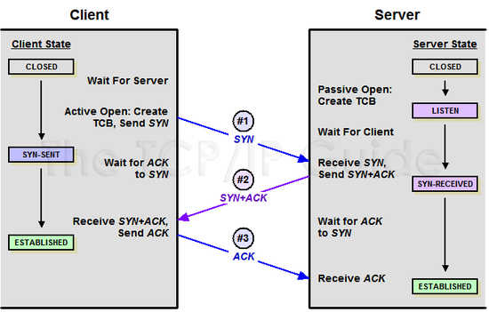

## HTTP(HyperText Transfer Protocol)
서버 접속 -> 클라이언트 -> 요청 -> 서버 -> 응답 -> 클라이언트 -> 연결 종료

클라이언트 : 웹사이트에 접속하는 사용자 또는 웹 브라우저
1. 사용자가 웹 브라우저에 URL 주소를 입력한다
2. DNS 서버에 웹 서버의 호스트 이름을 IP주소로 변경 요청한다
3. 웹 서버와 TCP 연결을 시도한다
  * [3way-handshaking](#3way-handshaking)
  ## 3way-handshaking
  - Client > Server : TCP SYN
  - Server > Client : TCP SYN ACK
  - Client > Server : TCP ACK
   
    
   
4. 클라이언트(웹 브라우저)가 서버에게 요청한다
  HTTP Request Message = Request Header + 빈 줄 + Request Body
  ** Request Header
  * 요청 메소드 + 요청 URI + HTTP 프로토콜 버전
  * 요청 라인 : 요청 메소드(GET,POST 등)와 요청 URI(Uniform Resource Identifier)가 포함된다
  * 헤더(Header) : 요청 메시지에 대한 추가 정보(쿠키, 클라이언트 정보, 인증 정보 등)가 포함된다
  * 본문 : POST 메소드와 같이 본문을 함께 전송할 경우에만 포함된다

5. 서버는 클라이언트의 요청에 대한 응답(Response)를 보낸다
   응답은 다음과 같은 요소로 이루어져 있다
   
  * 상태 라인 : 응답 코드(200 OK, 404 Not Found 등)와 프로토콜 버전 정보가 포함된다
  * 헤더 : 응답 메시지에 대한 추가정보(Content-Type, Content-Length)가 포함된다
  * 본문 : 요청에 대한 응답 데이터가 포함된다

6. 클라이언트는 서버로부터 받은 응답을 해석하고, 화면에 표시함
  HTTP는 TCP/IP 기반으로 동작하는데, 클라이언트와 서버는 연결을 맺고 요청 및 응답을 주고 받는다.
  HTTP는 암화화되지 않은 프로토콜이기 때문에, 데이터의 무결성과 보안성을 보장하지 않는다.
  이를 해결하기 위해 HTTPS 프로토콜을 사용할 수 있다.
  
  
  ## HTTPS(HyperText Transfer Protocol Secure)
  
   
  1. 클라이언트가 HTTPS로 암호화된 페이지를 요청한다
     브라우저마다 지원하는 암호화 알고리즘과 SSL 버전이 다르기 때문에 해당 정보를 전송하고, 클라이언트가 생성한 랜덤 데이터를 전송한다.
  2. 서버는 인증서를 클라이언트에게 제공한다. 이 인증서는 서버의 공개키를 포함하고 있다
     사용할 SSL버전과 암호화 알고리즘, 서버가 생성한 랜덤 데이터를 전송한다
  3. 클라이언트는 인증서가 신뢰할 수 있는지 확인하기 위해 발급기관(CA)에게 인증서를 제출한다
  4. 발급기관은 인증서가 서버의 공개키와 일치하는지 확인하고, 만약 인증서가 유효하다면 클라이언트에게 인증서의 일련번호를 서명하여 반환한다.
  5. 클라이언트는 발급기관의 공개키를 사용하여 일련번호 서명을 확인한다
    
  6. 클라이언트는 서버의 공개키를 사용하여 세션 키를 암호화하고 서버로 전송한다
  7. 서버는 자신의 개인키를 사용하여 세션 키를 복호화한다
     (1번과 2번과정에서 생성한 랜덤 데이터를 조합하여 pre master secret key를 생성하여 master key(대칭키)로 사용한다)
  8. 7번 이후에 보안 파라미터를 적용하거나 변경할 때 보내는 과정이다.
  9. 클라이언트와 서버는 이제 암호화된 HTTPS 연결을 통해 데이터를 주고 받는다

이렇게 하면 서버와 클라이언트 간의 통신이 암호화되기 때문에, 데이터의 무결성과 보안성이 보장됨

https://kimmeh1.tistory.com/499
