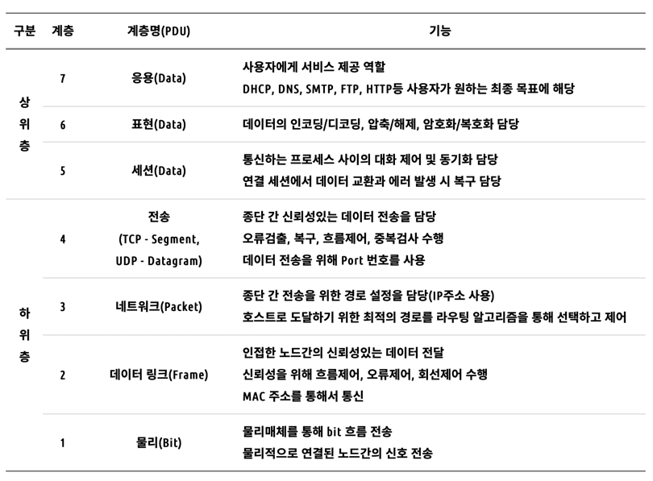

# OSI 7 계층

## 💡OSI 7 계층이란?
* 네트워크 프로토콜이 통신하는 구조를 7개의 계층으로 분리하여 각 계층 간 상호 작동하는 방식을 정해 놓은 것
* 개방된 시스템, 시스템 간의 상호 연결성을 부여하는 표준
---

## 💡OSI 7 계층을 나눈 이유
* 1980년대 네트워크 통신망이 확산되면서 다양한 통신망이 혼재된 상태였고, 이에 따라 네트워크 유형에 관계없이 상호 통신이 가능한 지침이 필요했었습니다. 
* 이러한 필요성이 대두됨으로써 ISO(국제표준화기구)는 ISO 7 계층이라는 새로운 네트워크 모델을 발표하였고 이 모델은 서로 다른 컴퓨터 기기간의 네트워크를 형성할 수 있도록 규정한 네트워크 모델 표준안입니다.
* OSI 7 계층으로 통신이 일어나는 과정을 크게 구분하여 단계별로 파악할 수 있고, 네트워크의 구성을 예측 이해할 수 있게 되었습니다.
* 또한 각 계층은 독립적이기 때문에 7 계층 중 특정한 곳에서 문제가 발생하면 해당 계층만 고치면 되며, 용이성, 유지관리가 좀 더 수월해지게 되었습니다.
---

## 🔎 OSI 7 계층

### ✔️ Layer1 : 물리 계층 (Physical Layer)
* (상위 계층에서 전송된 데이터를 물리 매체를 통해) 전기, 기계적인 신호를 주고받는 역할을 하는 계층
* 디지털에서 아날로그 혹은 그 반대로 신호를 변환
* 즉, 데이터를 전송하는 역할만 진행

> * 전송 단위: 비트(Bit)
> * 장비: 케이블, 허브
> * 프로토콜: Modem, Cable, Fiber

### ✔️ Layer2 : 데이터 링크 계층 (Data link Layer)
* 물리적인 연결을 통해 인접한 두 장치 간의 신뢰성 있는 정보 전송을 담당하는 계층
* 에러 검출, 재전송, 흐름 제어 역할을 함
* Point-To-Point 전송
* MAC 주소를 통해 통신

> * 전송 단위: 프레임(Frame)
> * 장비: 스위치
> * 프로토콜: 이더넷, MAC, PPP, ATM, LAN, Wifi

### ✔️ Layer3 : 네트워크 계층 (Network Layer)
* IP주소를 제공하는 계층
* 데이터를 목적지까지 가장 안전하고 빠르게 전달하는 기능을 담당
* 라우터를 통해 최적의 경로를 선택하여 IP 주소를 지정하고, 해당 경로에 따라 데이터 전달
  * 전송되는 데이터는 패킷단위로 분할하여 전송한 후 다시 합쳐짐

> * 전송 단위: 패킷(Packet)
> * 장비: 라우터, L3 스위치
> * 프로토콜: IP, ICMP

### ✔️ Layer4 : 전송 계층 (Transport Layer)
* 양 끝단(End to End)의 사용자들이 데이터를 주고 받을 수 있게 하는 계층
* 데이터 전송을 위해 Port번호 사용 (대표적인 프로토콜로 TCP와 UDP가 있음)
  * TCP와 UDP 프로토콜을 통해 통신을 활성화함. 포트를 열어두고, 프로그램들이 전송을 할 수 있도록 제공
    * TCP: 신뢰성, 연결지향적
    * UDP: 비신뢰성, 비연결성, 실시간
* 방화벽이나 프록시 서버가 여기에 해당
* 발신지에서 목적지(End-to-End) 간 제어와 에러를 관리함. 패킷의 전송이 유효한지 확인하고 전송에 실패된 패킷을 다시 보내는 것과 같은 신뢰성있는 통신을 보장

> * 전송 단위: 세그먼트(Segment)
> * 장비: 게이트웨이, L4 스위치
> * 프로토콜: TCP, UDP , ARP, RTP

### ✔️ Layer5 : 세션 계층 (Session Layer)
* 통신 세션을 구성하는 계층으로, 포트(Port)번호를 기반으로 연결
* 통신 장치 간의 상호작용 및 동기화를 제공하는 계층
* TCP/IP 세션을 만들고 없애는 역할(책임)
* 통신을 하기 위한 세션을 확립, 유지, 중단하는 역할
* 연결 세션에서 데이터 교환과 에러 발생 시 복구 관리

> 프로토콜: NetBIOS, SSH, TLS API, Socket

### ✔️ Layer6 : 표현 계층 (Presentation Layer)
* 데이터를 어떻게 표현할지를 정하는 역할을 하는 계층
  * 송신측과 수신측 사이에서 데이터 형식(png, jpg, jpeg...)을 정함
* 데이터 인코딩/디코딩, 압축/해제, 암호화/복호화 수행

> 프로토콜: JPEG, MPEG, SMB, AFP

### ✔️ Layer7 : 응용 계층 (Application Layer)
* 최종 목적지로, 사용자와 가장 밀접한 계층으로 인터페이스 역할을 하는 계층
* 응용 프로세스 간의 정보 교환을 담당
* 파일전송, DB, 메일 전송 등등의 서비스가 여기에 해당

> 프로토콜: DHCP, DNS, FTP, HTTP
---

## 💡OSI 7 계층 요약

[Reference]
* http://wiki.hash.kr/index.php/OSI_7_%EA%B3%84%EC%B8%B5
* https://ko.wikipedia.org/wiki/OSI_%EB%AA%A8%ED%98%95
* https://turtledeveloper.tistory.com/38