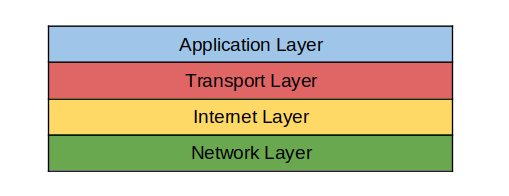

# TCP/IP의 개념
> __*인터넷 프로토콜이란?*__  
*인터넷에서 컴퓨터들이 서로 정보를 주고 받는데 쓰이는 통신규약. 여러가지 종류의 인터넷 프로토콜이 있으나 그 중 TCP/IP가 가장 많이 쓰이기 때문에 TCP/IP 프로토콜이라고 함께 부르는 경우가 많다.* 

TCP/IP는 하나의 프로토콜을 부르는 단어가 아닌 가장 많이 쓰는 프로토콜 두 개를 한번에 통칭하는 단어입니다. 이 개념을 제대로 이해하기 위해서는 먼저 인터넷에 대한 간단한 이해가 필요합니다. 

인터넷은 쉽게 말해 __컴퓨터끼리의 데이터 송수신을 위한 네트워크 시스템__ 으로 현대의 인터넷은 전세계에 걸쳐서 연결되어 있기 때문에(네트워크의 네트워크를 만들자는 목표인 international network가 어원!) 우리는 집에 편하게 앉아서 지구 반대편 대륙의 정보들을 열람할 수 있는 것이죠. 

여기서 컴퓨터가 통신을 할 때 서로 다른 형태로 데이터를 주고 받게 된다면 기껏 만들어 놓은 거대한 네트워크가 쓸모없어지기에 우리는 특정한 __프로토콜__ 을 만들어서 데이터를 송수신하게 된 것입니다. 

TCP/IP는 바로 이 프로토콜의 모음(set) 중 하나이자 현재 가장 많이 사용하고 있는 인터넷 프로토콜 슈트(internet protocol suite) 입니다. 

## TCP와 IP
TCP/IP는 패킷 통신 방식의 인터넷 프토토콜인 IP (인터넷 프로토콜)와 전송 조절 프로토콜인 TCP로 이루어져 있습니다. TCP는 IP 통신을 기반으로 작동하기 때문에 따로 생각하기 보단 하나의 흐름으로 보는 것이 좋습니다. 
### IP
IP의 정보는 패킷 혹은 데이터 그램이라고 하는 덩어리로 나뉘어져 전송되게 되는데 이 과정에서 데이터가 제대로 전달 되었는지, 데이터의 순서가 올바른지 보장하지 않는 특징이 있습니다. 따라서 IP의 특징을 비신뢰성(unreliability)과 비연결성(connectionlessness)이라고 말합니다.  
현재 인터넷에서 사용하는 표준 프로토콜은 4번째 버전인 IPv4(xxx.xxx.xxx.xxx 형태의 주소)이지만 고갈 문제를 겪고 있는 관계로 6번째 버전인 IPv6가 대중화 될 것이라고 예상하고 있습니다. 
### TCP
위의 IP의 문제를 보완하기 위한 목적을 가진 프로토콜로 TCP/IP의 핵심이라고 할 수 있습니다. 데이터의 전송 여부, 순서를 보장하기 위해 정보 전달을 통제한다고 하여 전송 제어 프로토콜(Transmission Control Protocol)을 줄여 TCP라고 부릅니다.  
데이터의 안정성을 보장하기 위한 방법으로 3 Way-Handshake라고 부르는 특별한 작동 방식을 채택하고 있습니다. 
1. 상대에게 통신을 하고 싶다는 메시지를 보낸다. (SYN)
2. 상대는 그 메시지에 대한 응답 + 나도 통신 준비가 되었다는 메시지를 보낸다. (SYN-ACK)
3. 2번에서 받은 메시지에 응답을 보낸다. (ACK)  

위의 과정을 통해 나와 상대방의 통신준비가 모두 마쳐진 상태를 유지하고 통신이 연결되어 있음을 보장하게 됩니다.   

위와 같은 특징 덕에 TCP는 다음과 같은 장점을 가집니다.  
#### 신뢰성 보장과 흐름제어   
네트워크를 통해 한번에 보낼 수 있는 데이터 양은 한계가 있습니다. 이것을 극복하기 위해 우리는 데이터를 쪼개서 보낸다는 방법을 채택하게 되었는데 이것을 우리는 패킷 혹은 데이터그램이라 부릅니다(이하 통일하여 패킷이라 부르겠습니다). 이때 생기는 또 다른 문제가 __제대로 보내졌는가 확인__ 하는 것과 __순서대로 수신이 되었는가 확인__ 하는 것이었습니다.  
이를 해결하기 위해 TCP에서는 각각의 패킷에 번호를 부여하여 통신하는 방법을 고안했습니다. 쉽게 비유로 예를 들어서 책을 친구에게 한 페이지 씩 보낸다고 생각해봅시다.  

친구에게 1 페이지 부터 5페이지까지 책을 보낸다고 했을 때 만약 중간에 3페이지를 받을 차례에 4페이지 혹은 5페이지가 온다면 그 친구는 3페이지가 유실되었다는 사실을 제게 알려줄 수 있고 저는 그 페이지부터 다시 보내줄 수 있습니다. (Stop and wait 방식)

이 때 만약 친구가 한 번에 2장씩 받을 수 있고 지금 2페이지를 받는 중이라 당장은 한번에 두 페이지를 받기가 어렵다면 나는 지금 3페이지 하나만 받을 수 있다고 제게 전달해 줄 수 있습니다. 이 때 저는 3페이지만 보내줌으로 친구의 부담을 덜어줄 수 있습니다.(sliding window 방식) 

이것을 흐름제어(Flow Control)라 부릅니다. 
#### 혼잡 제어
초기 TCP에는 존재하지 않았지만 인터넷을 사용하는 사람들이 점차 늘어가면서 네트워크에 주어지는 부담을 해결하기 위해 나타난 개념입니다. 특히 보내는 속도가 받는 속도를 뛰어 넘을 때 발생합니다.  
이번에는 저를 포함한 3명의 친구가 한번에 한 친구에게 각각 다른 책을 보낸다고 가정해봅시다.   
친구는 한번에 처리할 수 있는 페이지의 한계가 있습니다. 따라서 처리하는 동안 3명이서 한꺼번에 보내는 페이지에 대한 리액션을 보내주지 못하고 저를 포함한 3명의 친구들은 제대로 받았다는 리액션을 받지 못했기에 지속적으로 동일한 페이지를 계속 보내게 됩니다. 이때 받는 친구의 우체통(라우터)은 한계가 있고 한계를 넘어선 페이지들은 땅바닥에 버려져 낭비되게 될 것 입니다.  
이를 해결하기 위해 한번에 데이터를 보내는 양을 조절하는 것을 혼잡제어라 부릅니다. 

TCP는 위와 같은 다양한 장점이 있지만 때로는 신뢰성보다는 속도가 중요할 때가 있습니다. 따라서 신뢰성을 보장하지는 않지만 빠른 속도의 장점이 있는 UDP라는 통신 프로토콜을 사용하기도 합니다. 

## TCP/IP 모델 4계층
TCP/IP는 4개의 계층으로 나뉩니다. (OSI모형에서는 7계층으로 구분하지만 TCP/IP의 관점에서 보겠습니다)  
각각의 층은 서로 데이터를 주고 받는 논리적인 대상이자 목표라고 보시면 됩니다. 쉽게 말해 서로의 역할이 다르다고 할 수 있습니다.

1. Application Layer  
특정 서비스를 제공하기 위해 __어플리케이션끼리의 정보를 주고 받는 층__ 입니다. 예를 들면 이메일(SMTP)이나 가장 많이 사용하는 하이퍼텍스트 링크(HTTP)가 있습니다.  
FTP, HTTP, SSH, Telnet, DNS, SMTP 등등의 다양한 프로토콜들이 있습니다.
2. Transport Layer  
송신된 데이터를 __수신측 어플리케이션에 확실하게 전달하기 위한 층__ 입니다. 컴퓨터의 어플리케이션은 각각 사용하는 PORT 번호가 다른데 이 포트번호를 통해 어떤 어플리케이션에 전달할 것인지 찾아주는 역할을 합니다.  
TCP, UDP, RTP, RCTP 등의 프로토콜이 있습니다.
3. Internet Layer  
__수신 측 까지 데이터를 전달하기 위해 사용되는 층__ 입니다. 쉽게 말해 어떤 네트워크 장비(라우터, 컴퓨터 등등)에 정보를 전달할 것(라우팅)인지 결정하는 층이라고 할 수 있습니다. 송신측 , 수신측 모두 IP주소를 가지고 있기 때문에 이 주소를 통해 정확하게 전달할 대상을 찾을 수 있습니다.  
IP, ARP, ICMP, RARP, OSPF 등의 프로토콜이 있습니다. 
4. Network Access Layer  
네트워크에 연결된 __물리적인 기기 간 전송을 담당하는 층__ 입니다. 물리주소인 MAC주소가 이 계층에서 사용됩니다. 컴퓨터에 장착하는 랜카드가 바로 이 계층에서 사용되는 장비로 실제 디지털 신호를 주고받는 층이라고 할 수 있습니다.  
Ethernet, TokenRing, FDDI 등의 프로토콜이 있습니다. 

## 대략적인 TCP/IP의 흐름
브라우저의 주소창에 www.naver.com을 입력한다면 다음과 같은 일이 일어납니다. 각 계층 별로 HTTP, TCP, IP, Ethernet 프로토콜을 사용한다고 가정해보겠습니다. 
 
1. 먼저 네이버의 웹 서버에 HTTP 요청을 보내기 위해 다음과 같은 순서로 각 계층에 필요한 정보들을 담은 패킷을 만들어야 합니다. 
    * HTTP 통신을 사용하는 Application Layer에서는 HTTP 헤더를 통해 method, path, 등등의 정보를 담습니다. 
    * Transport Layer에는 TCP 헤더가 들어가는데 여기서는 출발지 포트번호인 SP와 목적지 포트번호인 DP를 중요하게 봅니다. 
    * Internet Layer에는 IP 헤더가 들어가는데 우리가 주소창에 작성한 것은 도메인 네임이므로 이것을 IP주소로 바꿔줄 도메인 네임 서버(DNS)를 통해 네이버 웹 서버의 IP주소를 알아냅니다. 
    * Network Access Layer에는 Ethernet헤어가 들어가는데 여기서 물리주소인 출발지와 목적지의 MAC주소가 필요합니다. 이때 목적지의 MAC주소를 알아내기 위해 ARP프로토콜을 사용합니다. 
2. 패킷을 전송하기 위해 연결지향형 프로토콜인 TCP는 송신측과 수신측이 연결되는 작업인 3 Way Handshaking을 완료합니다. 
3. MAC주소와 IP주소를 이용한 반복적인 라우팅을 통해 패킷을 목적지 서버까지 전송합니다. 
4. 보낸 요청에 대한 응답으로 네이버 웹 서버로 부터 적절한 라우팅을 통해 HTML을 받아냅니다. 
5. 응답받은 HTML을 브라우저를 통해 띄워 줍니다. 
6. 데이터 송수신이 모두 완료된 이후 네이버 웹서버와의 TCP연결을 4 way handshaking을 통해 종료해줍니다. 

## Reference
* https://devowen.com/344
* https://youtu.be/BEK354TRgZ8
* https://ko.wikipedia.org/wiki/%EC%9D%B8%ED%84%B0%EB%84%B7
* https://ko.linux-console.net/?p=2632#gsc.tab=0
* https://www.ibm.com/docs/ko/aix/7.1?topic=management-transmission-control-protocolinternet-protocol