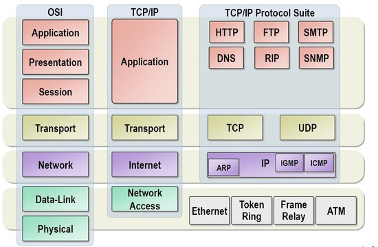
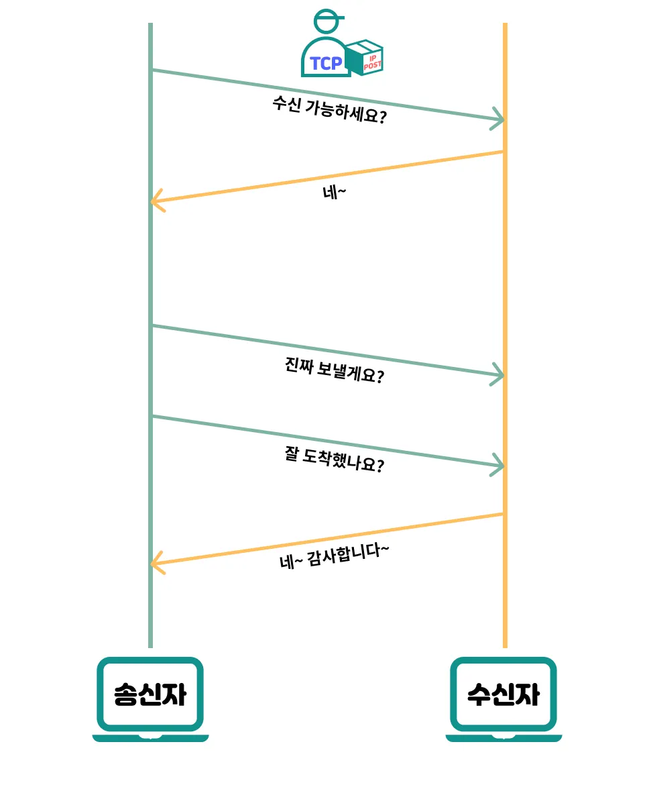
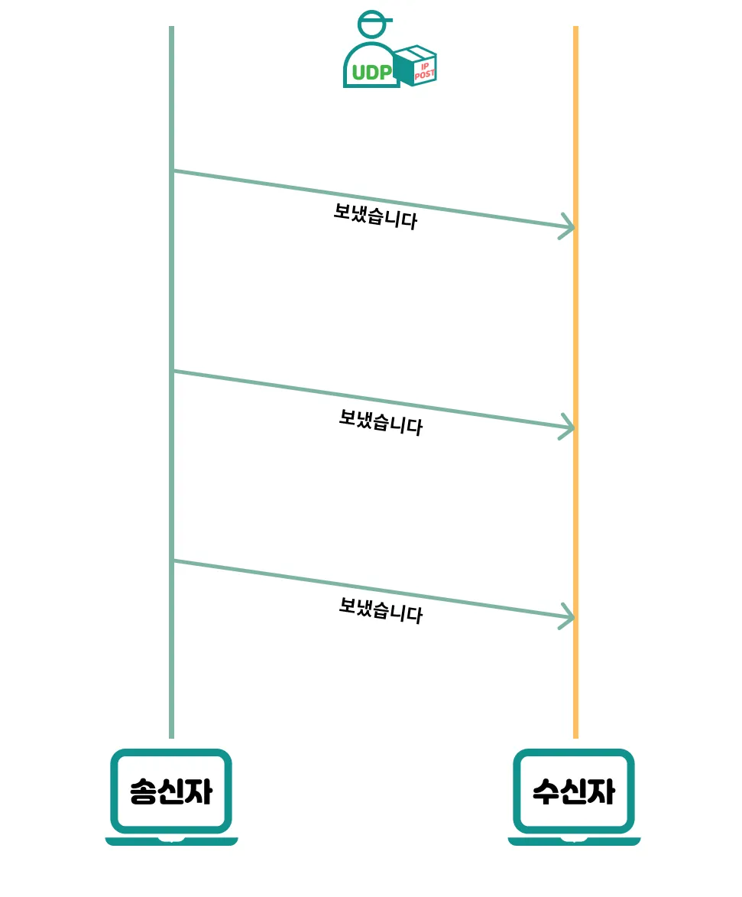
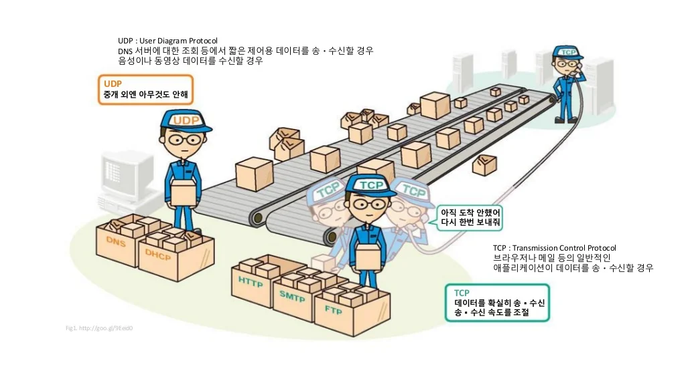

# TCP와 UDP

TCP와 UDP는 OSI 7 계층들 중 TCP/IP의 전송 계층에서 사용되는 프로토콜이다. 데이터 전달을 담당하며 전달되는 패킷의 오류를 검사하고 재전송 요구 등의 제어를 담당한다.

✏️ 패킷 (Packet)이란?

인터넷 내에서 데이터를 보내기 위한 경로배정(라우팅)을 효율적으로 하기 위해서 데이터를 여러 개의 조각들로 나누어 전송을 하는데 이때, 이 조각을 패킷이라고 함

 

## 💡 TCP (Transmission Control Protocol)

- 연결 지향적인 프로토콜
- 인터넷상에서 데이터를 메세지의 형태로 보내기 위해 IP와 함께 사용하는 프로토콜
- 장치들 사이에 논리적인 접속을 성립하기 위해 연결을 설정해 신뢰성을 보장하는 연결형 서비스
- 네트워크에 연결된 컴퓨터에서 실행되는 프로그램 간에 일련의 옥텟 (데이터, 메시지, 세그먼트라는 블록 단위)을 **안정적으로**, **순서대로**, **에러 없이** 교환할 수 있게 함

 

### 특징

1. 연결형 서비스로 가상 회선 방식을 제공

- 3-way handshaking 과정을 통해 연결 설정
- 4-way handshaking 과정을 통해 연결 해제

2. 흐름 제어 (Flow control)

- 데이터 처리 속도를 조절하여 수신자의 버퍼 오버플로우를 방지
- 수신자가 송신자에게 전송할 수 있는 데이터 양을 제한하여, 송신자가 수신자의 처리 능력을 초과하여 데이터를 전송하는 것을 방지
  - 데이터 손실을 최소화하고, 전송 속도를 유지

✏️ 버퍼 오버플로우란?

사용자(수신자)가 입력한 데이터의 크기가 너무 과하여 제한된 버퍼용량에서 넘침을 의미

3. 혼잡 제어 (Congestion control)

- 네트워크 내의 패킷 수가 과도하게 증가하지 않도록 방지
  - 네트워크 내의 혼잡 상태를 감지하여 데이터 전송 속도를 조절

4. 높은 신뢰성 보장

- 데이터 전송 시, 손실이나 에러가 발생하면 재전송을 요청하여 신뢰성을 보장
- 신뢰성이 높은 전송을 하기 때문에 UDP 보다 속도가 느림

5. 전이중 (Full-Duplex), 점대점 (Point to Point) 방식

- 전이중 (Full-Duplex) : 전송이 양방향으로 동시에 일어날 수 있음
- 점대점 (Point to Poing) : 각 연결이 정확히 2개의 종단점을 가지고 있음

 
  
- multicasting, broadcasting 을 지원하지 않음

 

### TCP의 장단점

**장점**

- 신뢰성 높음
  - 데이터 전송 시, 손실이나 에러가 발생하면 재전송을 요청하여 데이터 손실 방지
- 흐름 제어 및 혼잡 제어 기능을 제공하여 데이터 전송 속도를 조절함

**단점**
  
- 연결 설정 과정이 필요하기 때문에, 초기 지연이 발생할 수 있음
- 오버헤드가 크기 때문에 데이터 전송 속도가 느릴 수 있음

 

### TCP의 사용 예시

TCP는 연속성보다 신뢰성 있는 전송이 중요할 때 사용하는 프로토콜

- 파일 전송
- 웹 브라우징
- 이메일

> 신뢰성이 중요한 데이터 전송에 사용

 

- - -

## 💡 UDP (User Datagram Protocol)

- 비연결형 프로토콜
- 데이터를 데이터그램 단위로 처리하는 프로토콜
- 연결을 위해 할당되는 논리적인 경로가 없고, 각각의 패킷은 다른 경로로 전송되며, 독립적인 관계를 가짐

✏️ 데이터그램이란?

여기서 데이터그램이란 독립적인 관계를 지니는 패킷이라는 뜻

 

### 특징

1. 비연결형 서비스로 데이터그램 방식을 제공

- 데이터의 전송 순서가 바뀔 수 있음

2. 데이터 수신 여부를 확인하지 않음

- TCP의 3-way handshaking 과 같은 과정 X

3. 신뢰성 낮음

- 흐름 제어가 없어 제대로 전송되었는지, 오류가 없는지 확인할 수 X

4. TCP보다 속도가 빠름
5. 1:1, 1:N, N:N 통신이 가능

 

### UDP의 장단점

**장점**

- 연결 설정 과정이 없어 초기 지연이 발생하지 않음
- 오버헤드가 적기 때문에, 데이터 전송 속도가 빠름

**단점**

- 신뢰성을 보장하지 않음
  - 데이터 전송 시, 손실이나 에러가 발생할 가능성이 있음
- 흐름 제어 및 혼잡 제어 기능이 없기 때문에, 데이터 전송 속도를 제어할 수 없음

 

### UDP의 사용 예시

신뢰성보다는 연속성 있는 전송이 필요할 때 사용하는 프로토콜
- 데이터를 빠르게 전송하고자 할 때, 혹은 손실이 발생해도 복구가 가능한 경우에 사용

 

- 동영상 스트리밍 등 실시간 서비스 (Streaming)
- 음성 통화

> 데이터 전송 속도가 중요한 서비스에 사용

 

- - -

## TCP와 UDP의 차이점

프로토콜 종류|TCP|UDP
:---:|:---:|:---:
연결 방식|연결형 프로토콜|비연결형 프로토콜
패킷 교환 방식|가상 회선 방식|데이터그램 방식
전송 순서|전송 순서 보장|전송 순서 바뀔 수 있음
수신 여부 확인|수신 여부 확인|수신 여부 확인 X
통신 방식|1:1 통신|1:1 or 1:N or N:N 통신
신뢰성|높음 (데이터 재전송 존재)|낮음 (데이터 재전송 X)
속도|느림|빠름

 

> 👉 참고 
> [TCP 와 UDP 차이를 자세히 알아보자](https://velog.io/@hidaehyunlee/TCP-%EC%99%80-UDP-%EC%9D%98-%EC%B0%A8%EC%9D%B4)  
> [TCP와 UDP 차이 그리고 TCP/IP](https://madplay.github.io/post/network-tcp-udp-tcpip)  
> [TCP와 UDP의 특징과 차이](https://mangkyu.tistory.com/15)  
> [TCP와 UDP의 특징 및 차이점 알아보기](https://dev-coco.tistory.com/144)
