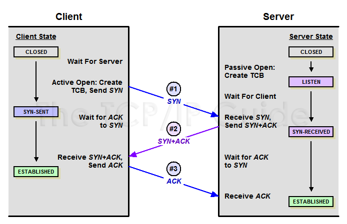

## Index

- [TCP 통신의 특징](#TCP-통신의-특징)

- [3 way handshake](#3-way-handshake)

- [4 way handshake](#4-way-handshake)

- [References](#References)

---

## TCP 통신의 특징

- `정확한 전송을 보장`

- 신뢰성을 보장하는 연결형 서비스

    
TCP Header의 Flag Bit

- `SYN` 
    : 연결 설정 요청. 
      양쪽이 보낸 최초의 패킷에만 SYN 플래그를 설정함.
- `ACK` 
    : 응답 유효 여부 설정. 
      최초의 SYN 패킷 이후의 모든 패킷은 ACK 플래그 설정 필요. 
      데이터를 잘 받았으면 ACK(=SYN+1)을 전송함.
- `FIN` 
    : 연결 종료 의사 표시

    
통신 요청자와 수신자의 Port 상태

- `CLOSED` 
    : 포트가 닫힌 상태 
    연결 수립을 시작하기 전의 기본 상태 (연결 없음)
- `LISTEN` 
    : 포트가 열린 상태로 연결 요청 대기 중
- `SYN-SENT` 
    : SYN 요청을 한 상태
- `SYN-RECEIVED` 
    : SYN 요청을 받고 상대방의 응답을 기다리는 중
- `ESTABLISHED` 
    : 포트 연결의 수립이 완료된 상태, 서로 데이터를 교환할 수 있음

 

## 3 way handshake

- 데이터의 정확한 전송을 보장하기 위해 네트워크 `연결을 설정`(Connection Establish) 하는 과정

- 양쪽 모두 데이터를 전송할 준비가 되었다는 것을 보장하며, 
데이터 전달 시작 전에 한 쪽이 다른 한 쪽도 준비되었다는 것을 알 수 있음.
 

> ### P(Client)가 Q(Server)에 연결을 요청

    
1. P `->` Q (`SYN`) 
    - PORT 상태 
    : P는 CLOSED, Q는 LISTEN 이 됨.
    - P가 Q에게 연결 요청 메세지 전송
    - 송신자가 최초로 데이터를 전송할 때 Sequence Number를 임의의 랜덤 숫자로 지정하고, SYN 플래그 비트를 1로 설정한 세그먼트를 전송함.
    - PORT 상태 
    : P는 SYN-SENT, Q는 SYN_RCV 가 됨.

2. P `<-` Q (`SYN + ACK`) 
    - Q가 P의 연결 요청을 수락하였으며 P도 포트를 열어달라는 메세지 전송
    - 수신자는 Acknowledgement Number 필드를 (Sequence Number + 1)로 지정하고, SYN과 ACK 플래그 비트를 1로 설정한 세그먼트를 전송함.
    - PORT 상태 
    : P는 ESTABLISHED, Q는 SYN_RCV 가 됨.

3. P `->` Q (`ACK`) 
    - P가 Q에게 수락 확인을 보내서 연결을 맺음
    - 이때, 전송할 데이터가 있으면 이 단계부터 데이터를 전송도 가능
    - PORT 상태 
    : P는 ESTABLISHED, Q는 ESTABLISHED 가 됨.

 

> #### 2 way handshake는 연결 설정 불가능?
TCP 커넥션은 `양방향성`(bidirectional) connection이기 때문이다. 
요청자가 수신자에게 존재를 알리고 패킷을 보낼 수 있다는 것을 알리듯, 수신자도 요청자에게 존재를 알리고 패킷을 보낼 수 있다는 신호를 보내야 한다.

비유를 들자면 아래와 같은 과정이다.

1. 요청자가 자신의 목소리가 들리는지 물어본다(`SYN`)
2. 수신자는 요청자의 목소리가 들린다고 말한다.(`SYN+1`) 
그리고 자신의 목소리가 들리는지 물어본다.(`ACK`)
3. 요청자는 수신자의 목소리가 들린다고 말한다.(`ACK+1`)

 

## 4 way handshake

- TCP의 `연결을 해제`(Connection Termination) 하는 과정
 

> ### P(Client)가 Q(Server)에 연결 해제를 요청

    
1. P `->` Q (`FIN`) 
    - P가 Q에게 `연결을 종료하겠다`는 FIN 플래그를 전송
    - Q가 P에게 FIN 플래그로 응답하기 전까지 연결을 계속 유지

2. P `<-` Q (`ACK`) 
    - Q는 일단 `확인 메세지`를 보내고 자신의 통신이 끝날 때까지 기다림(CLOSE_WAIT 상태)
    - Q는 Acknowledgement Number 필드를 (Sequence Number + 1)로 지정하고, ACK 플래그 비트를 1로 설정한 세그먼트를 전송함.
    - 그리고 Q가 전송할 데이터가 남아있다면 이어서 계속 전송함.

3. P `<-` Q (`FIN`) 
    - Q가 통신이 끝났으면(데이터를 모두 보냈다면) `연결 종료 요청에 합의`한다는 의미로 P에게 FIN 플래그를 전송

4. P `->` Q (`ACK`) 
    - P는 `확인`했다는 메세지를 전송

 

> #### 3 way handshake는 연결 해제 불가능?
요청자가 데이터 전송을 마쳤다고 하더라도 수신자는 아직 보낼 데이터가 남아있을 수 있기 때문에 
일단 FIN에 대한 ACK만 보내고, 데이터를 모두 전송한 후에 자신도 FIN 메시지를 보내야하기 때문이다.

 

## References

[깃허브 레퍼런스1(자세함)](https://github.com/shinhee-rebecca/2022-cs-study/blob/main/Network/TCP%203-way-hand-shake.md)

[깃허브 레퍼런스2](https://github.com/WeareSoft/tech-interview/blob/master/contents/network.md#tcp%EC%9D%98-3-way-handshake%EC%99%80-4-way-handshake)

[깃허브 레퍼런스3](https://github.com/gyoogle/tech-interview-for-developer/blob/master/Computer%20Science/Network/TCP%203%20way%20handshake%20%26%204%20way%20handshake.md#4-way-handshake---%EC%97%B0%EA%B2%B0-%ED%95%B4%EC%A0%9C)
