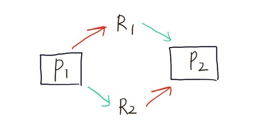

## DeadLock의 개념과 조건

- 프로세스가 자원을 얻지 못해 다음 처리를 하지 못하는 상태로, '교착 상태'라고도 한다
- 시스템적으로 한정된 자원을 여러 곳에서 사용하려고 할 때 발생함
- 둘 이상의 프로세스가 다른 프로세스가 점유하고 있는 자원을 서로 기다릴 때 무한 대기에 빠지는 상황

 
<P1,P2는 각각 상대가 점유 중엔 R1,R2를 요구하고 있다>

## DeadLock의 발생조건

  임의의 자원을 계속 점유하고 있어야 하고, 필요한 자원을 할당받을 때 까지 대기하고 있어야 한다
  DeadLock은 아래의 4가지 조건을 모두 만족할 때 발생하게 된다
  
- 상호 배제(MUTEX)
  한 번에 프로세스 하나만 해당 자원을 사용할 수 있다
  사용 중인 자원을 다른 프로세스가 사용하려면 요청한 자원이 해제 될 때까지 기다려야 한다
- 점유 대기(Hold & Wait)
  자원을 최소한 하나 보유하고, 다른 프로세스에 할당된 자원을 점유하기 위해 대기하는 프로세스가 존재해야 한다
- 비선점(Non-Preemptive)
  이미 할당된 자원을 강제로 빼앗을 수 없다(비선점)
  자원을 점유한 프로세스가 해당 자원을 스스로 반납하지 않는 한, 다른 프로세스는 그 자원을 사용할 수 없다
- 순환대기(Circular Wiat)
  대기 프로세스의 집합이 순환 형태로 자원을 대기하고 있어야 한다
  두 개 이상의 프로세스들이 자원을 점유하고 있으며, 각 프로세스는 다음 프로세스가 점유한 자원을 대기하고 있는 상태를 말한다

## DeadLock 예방

  위의 4가지 조건(상호 배제, 점유 대기, 비선점, 순환대기) 중 하나 이상의 조건이 만족하지 않도록 하면 된다!
  
 - 자원의 상호 배제 조건 방지 : 한 번에 여러 프로세스가 공유 자원을 사용할 수 있게 한다
   (상호 배제 조건 방지를 할 경우 DeadLock이란 의미가 없다는 말이 있다)
   
 - 점유 대기 조건 방지 : 프로세스 실행에 필요한 모든 자원을 한꺼번에 요구하고 허용될 때까지 작업을 보류해서,나중에 또 다른 자원을 점유하기 위한 대기 조건을 성립하지 않도록 한다 
   이 경우의 단점 : 시스템은 프로세스에게 모든 디스크 드라이브를 한 번에 제공해야 하므로, 자원낭비 발생, 무한 지연 발생가능 
 - 비선점 조건 방지 : 이미 다른 프로세스에게 할당된 자원이 선점권이 없다고 가정할 때, 높은 우선순위의 프로세스가 해당 자원을 선점할 수 있도록 한다
 - 순환 대기(환형 대기) 조건 방지 : 자원을 순환 형태로 대기하지 않도록 일정한 한쪽 방향으로만 자원을 요구할 수 있도록 한다.

시스템의 처리량이나 효율성을 떨어트리는 단점이 발생할 수 있다.

## DeadLock 회피

Safe sequence, Safe state
특정한 순서로 프로세스들에게 자원을 할당, 실행 및 종료 작업을 할 때
데드락이 발생하지 않는 순서를 찾을 수 있다면 안전순서(safe sequence)라 부름

잘 알려진 교착 상태 회피 알고리즘으로 Dijkstra의 은행원 알고리즘이 있다

* Dijkstra 은행원 알고리즘
  운영체제는 안전상태를 유지할 수 있는 요구만을 수락하고 불안전 상태를 초래할 사용자의 요구는 나중에 만족될 수 있을 때까지 계속 거절한다 

## DeadLock Recovery
  프로세스를 무기한 정지시킨 후, 시스템에서 제거하고 다음에 다시 계속하도록 하는 것
  [Difficulties]
  대부분의 시스템은 프로세스를 무기한 정지시키고 이를 시스템에서 제거한 후 다시 계속하도록 하는 기능이 없다
  효율적인 중지, 재개 기능이 있다 하더라도 이를 수행하는 데에는 비용이 발생하며, 주의를 요한다
  교착 상태에 있는 프로세스들을 중지할 땐 일반적으로 우선 순위가 낮은 순서부터 중지시키는 것이 가장 적은 비용을 초래하나, 교착 상태에 있는 프로세스들간에 우선순위가 없는 경우 오퍼레이터가 임의로 결정을 내려야 한다
  우선 순위가 있다 하더라도 Deadline Scheduling과 같이 우선순위가 뒤죽박죽이 되는 경우가 있다
  
  [따라서, 고려해야 할 점]
  victim 선정 정책
  rollback 정책
  starvation 문제의 해결책

##References
[블로그 레퍼런스1](https://velog.io/@hamsik2rang/OS-%EA%B5%90%EC%B0%A9-%EC%83%81%ED%83%9CDeadlock)
[블로그 레퍼런스2](https://jwprogramming.tistory.com/12)
[블로그 레퍼런스3](https://chanhuiseok.github.io/posts/cs-2/)

