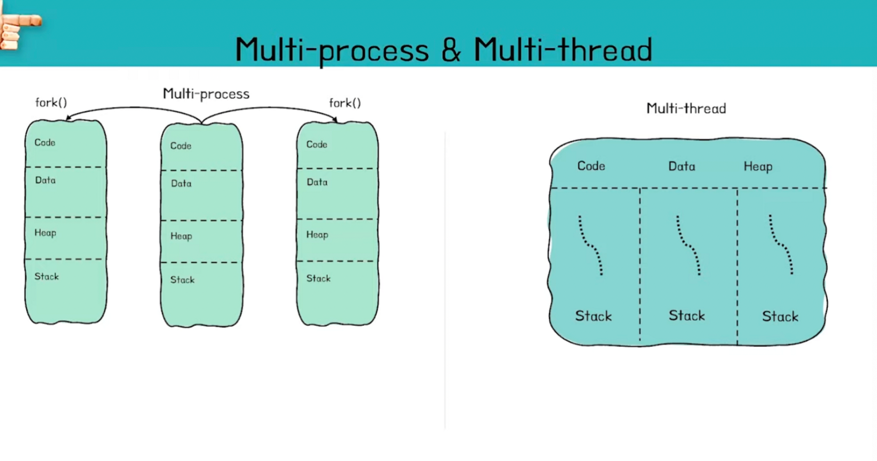
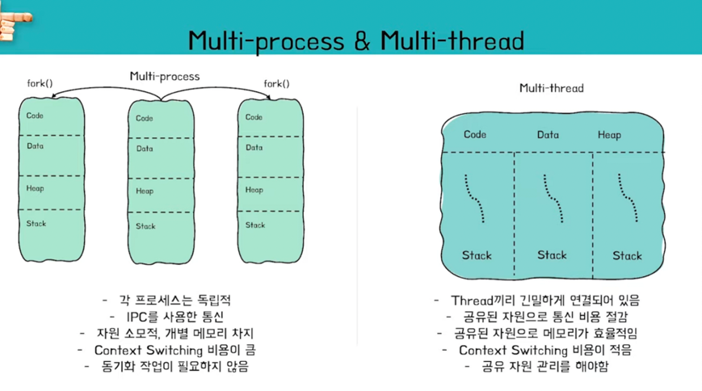
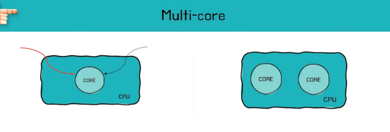
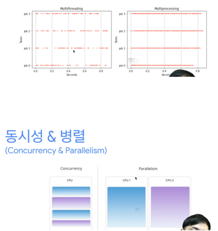
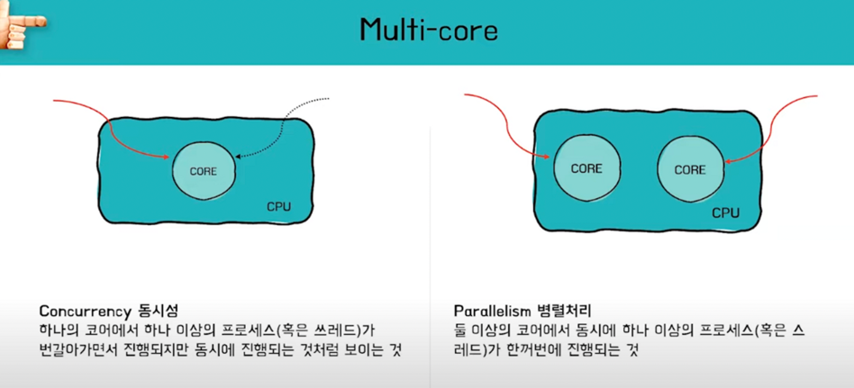

# 멀티 프로세스 대신 멀티 스레드를 사용하는 이유


## 💡프로그램과 프로세스
* 프로그램
    * = 애플리케이션, 앱 이라고도 불림
    * 윈도우 운영체제에서는 ```.exe``` 파일의 모습을 하고 있음
    * 프로그램은 컴퓨터 관점에서 ```하드디스크``` 즉, ```저장 장치만 사용```하는 수동적인 존재임
* 프로세스
    * = 실행중인 프로그램
    * 실행중인 프로그램?
        * 하드디스크에 저장된 프로그램이 **메모리에 올라갔을 때** 실행중인 프로그램, 즉 프로세스라 불림
        * 프로세스는 운영체제에 의해 관리됨
        * 


## 💡프로세스와 스레드
* 스레드
    * 프로세스 내에 존재하는 것으로 1개 이상이 있을 수 있음
    * 한 프로세스 내의 스레드들은
        * 코드, 데이터, 힙 영역을 공유된 자원으로 사용함 - 공유되는 자원
        * 스택만은 따로 가지고 있음 - 독립적인 자원


## 💡멀티 프로세스 & 멀티 스레드
* 모두 여러 개의 작업을 동시에 처리하는 기술이지만 두 개의 **처리 방식** 이 다르며, 각각의 특징과 장단점이 있습니다



* 멀티 프로세스 (Multi-Process)
  * 두 개 이상 다수의 프로세스(CPU)가 협력적으로 하나 이상의 작업(Task)을 동시에 처리하는 것이다 (병렬처리)
  * 각 프로세스 간 메모리 구분이 필요하거나 독립된 주소 공간을 가져야 할 경우 사용한다
  * 추가
    * 한 프로세스는 매번 하나의 일만 처리할 수 있기 때문에 동시에 두 가지를 처리할 수 없음
    * 그래서 부모 프로셋가 fork()를 해서 자식 프로세스를 여러 개 만들어서 이를 처리하도록 함
    * 이때 자식 프로세스는 부모와 별개로 메모리 영역을 확보하게 됨
    * (프로세스가 다수의 스레드로 구분되어 있지 않으면 단일 스레드 하나로 프로세스가 실행이 된다 - 이때 실행 단위는 프로세스 그 자체가 됨)

* 멀티 스레드 (Multi-Thread)
  * 하나의 프로세스에 여러 스레드로 자원을 공유하며 작업을 나누어 수행하는 것이다
  * 스레드는 한 프로세스 내에서 구분지어진 실행 단위임
  * 프로세스 내에서 분리해서 여러 스레드로 나뉘어서 실행 단위가 나뉘어지면 이것이 멀티스레드가 된다




### 💡💡 멀티 스레드 & 멀티 프로세스 장단점 분석

* 멀티 스레드
  * 장점
    * (멀티 프로세스보다) 적은 통신 비용, 적은 메모리 차지
    * (멀티 프로세스보다) Context Switching이 빠름
  * 단점
    * 동기화 문제
    * 하나의 스레드 장애로 (전체 프로세스가 영향을 받을 수 있어) 전체 스레드가 종료 될 위험이 있음

* 멀티 프로세스
  * 장점
    * 안정성이 높음 (하나의 프로세스가 죽더라도 다른 프로세스에 영향 X)
    * 보안성이 높음
  * 단점
    * (멀티 스레드보다) 많은 메모리공간 차지
    * (멀티 스레드보다) 많은 CPU 시간을 차지
  * 특징
    * 여러 개의 CPU를 처리할 수 있어 병렬 처리가 가능


### 💡💡 왜 멀티 프로세스로 할 수 있는 작업들을 굳이 하나의 프로세스에서 스레드로 나눠가며 할까?

* 운영체제가 시스템 자원을 효율적으로 관리하기 위해 스레드를 사용한다.
* 멀티 프로세스로 실행되는 작업을 멀티 스레드로 실행할 경우, 프로세스를 생성하여 자원을 할당하는 시스템 콜이 줄어들어 자원을 효율적으로 관리할 수 있다.
* 또한, 프로세스 간의 통신보다 스레드 간의 통신 비용이 적으므로 작업들 간 통신의 부담이 줄어든다. (처리비용 감소. 프로세스는 독립구조이기 때문)


> 두 방법은 동시에 여러 작업을 수행한다는 점에서 동일하지만,   
> 각각의 장단점이 있으므로 적용하는 시스템에 따라 적합한 동작 방식을 선택하고 적용해야 한다.


### 💡💡 멀티 스레드 & 멀티 프로세스 각각에 적합한 상황?   


<details>
<summary>안정성이 중요한 경우</summary>
<div>
멀티 프로세스를 선택합니다.   
멀티 프로세스는 각각의 프로세스가 독립적인 메모리 공간을 가지고 있기 때문에 한 프로세스에서 발생한 오류가 다른 프로세스에 영향을 미치지 않습니다.  
따라서 안정성이 중요한 시스템에서는 멀티 프로세스를 사용하는 것이 좋습니다
</div>
</details>


<details>
<summary>대규모 데이터 처리가 필요한 경우</summary>
<div>
멀티 프로세스를 선택합니다.   
멀티 프로세스는 병렬 처리가 가능하기 때문에 대규모 데이터 처리가 필요한 경우에는 멀티 프로세스를 사용하는 것이 효율적입니다.
</div>
</details>


<details>
<summary>자원 효율성이 중요한 경우</summary>
<div>
멀티 스레드를 선택합니다.   
멀티 스레드는 여러 개의 스레드가 하나의 프로세스 내에서 동작하기 때문에 프로세스 간 통신이 필요하지 않아 자원 사용이 적습니다.   
따라서 자원 효율성이 중요한 시스템에서는 멀티 스레드를 사용하는 것이 좋습니다.
</div>
</details>


<details>
<summary>동기화가 필요한 경우</summary>
<div>
멀티 스레드를 선택합니다.   
멀티 스레드는 공유된 메모리 영역에 접근하여 작업을 수행하기 때문에 동기화가 필요한 경우에는 멀티 스레드를 사용하는 것이 좋습니다.  
하지만 동기화를 잘못 구현하면 경쟁 상태(race condition)가 발생하여 예기치 못한 결과를 초래할 수 있으므로 주의가 필요합니다.
</div>
</details>


<details>
<summary>GUI 애플리케이션 등 반응성이 중요한 경우</summary>
<div>
멀티 스레드를 선택합니다.   
GUI 애플리케이션 등 반응성이 중요한 시스템에서는 멀티 스레드를 사용하여 작업을 분할하여 처리하는 것이 좋습니다.  
멀티 스레드를 사용하면 작업이 블로킹(blocking)되지 않고, 사용자 인터페이스 등 다른 작업도 동시에 처리할 수 있기 때문입니다.
</div>
</details>


### 💡 싱글 코어 & 멀티 코어 - 멀티 스레드랑 멀티 프로세스랑 무슨 연관이지?



* 멀티 프로세스, 멀티 스레드
  * 소프트웨어의 측면에 가까움
  * "처리 방식"의 일종
* 싱글 코어, 멀티 코어
  * 하드웨어의 측면에 가까움
  * 관련된 키워드 - (싱글 코어: 동시성) / (멀티 코어: 병렬처리)


| Single-core                                                                                                                                                                                            | Multi-core                                                                                                                                                        |
|--------------------------------------------------------------------------------------------------------------------------------------------------------------------------------------------------------|-------------------------------------------------------------------------------------------------------------------------------------------------------------------|
| 싱글 코어를 가진 CPU가 실행단위를 처리할 때에는<br/>동시에 여러 가지가 진행되기 위해서 빠른 텀으로 전환<br/>이 되면서 실행이 된다 - **동시성**<br/>-> 여러 실행 단위를 번갈아 실행하면서 동시에 일어난 **것처럼** 보이게 함<br/><br/>동시성: 이렇게 짧은 순간에 cpu의 시간을 분할해서 동시에 **하는 것처럼** 보이게 함 | 멀티 코어는 병렬처리,<br/>즉, 물리적으로 여러 코어를 사용해서 다수의 실행 단위를 한 순간에 처리할 수 있게 해준다<br/><br/>이렇게 한꺼번에 두 개의 코어에서 각각 실행단위가 진행이 될 수 있다 = 병렬처리<br/><br/>다수의 프로세서로 여러 가지 일을 각 코어에서 진행함 |








---

[Reference]
* https://www.youtube.com/watch?v=RrfASw-jfZ4
* https://www.youtube.com/watch?v=dzfij2nZbRw
* https://www.youtube.com/watch?v=1grtWKqTn50
* https://wooody92.github.io/os/멀티-프로세스와-멀티-스레드/
* Chat GPT