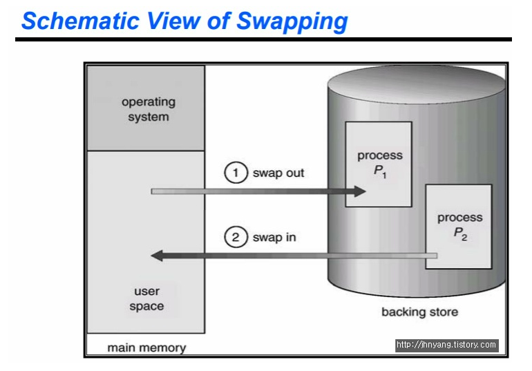
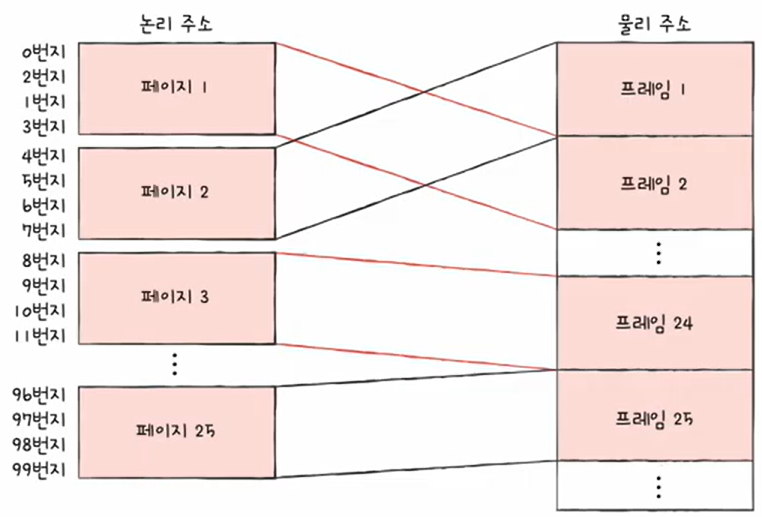
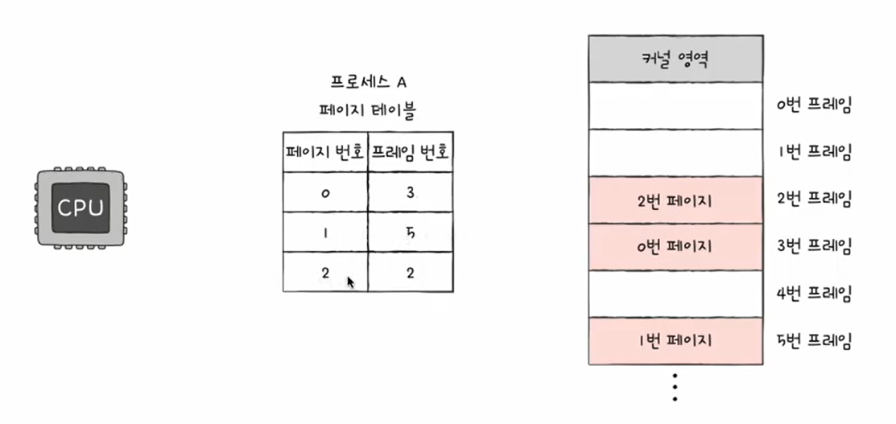
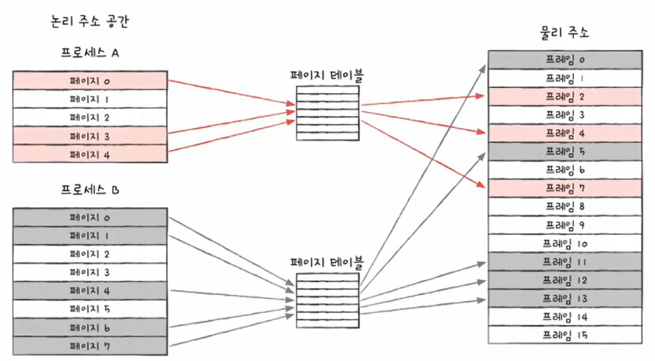
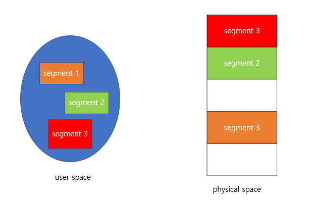
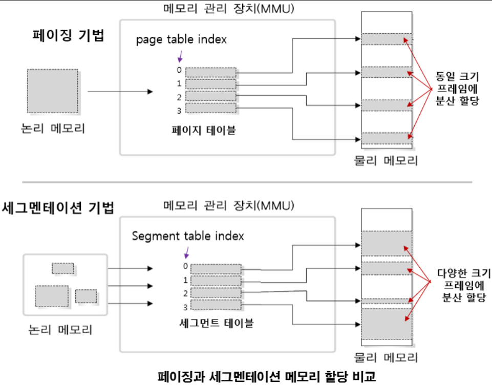
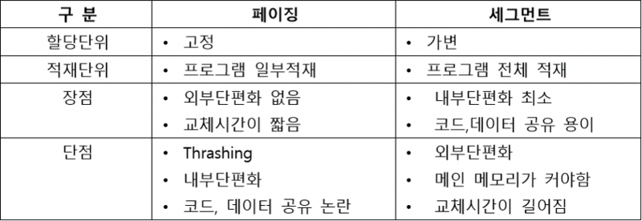
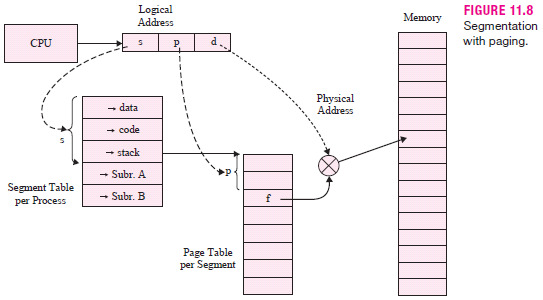

## Index

- [스와핑(Swapping)](#스와핑(Swapping))

- [페이징(Paging)](#페이징(Paging))

- [세그멘테이션(Segmentation)](#세그멘테이션(Segmentation))

- [페이징과 세그멘테이션 혼용](#페이징과-세그멘테이션-혼용)

---
 

프로세스가 CPU에 할당되기 전에 주 기억장치(메모리)를 거친다.
> `보조 기억장치(하드디스크)` → `주 기억장치(메모리)` → `CPU`

따라서 메모리를 잘 관리하여 한정된 자원을 효율적으로 사용해야한다.

 
 

## 스와핑(Swapping)

### 💡스와핑이란?
> `주 기억장치에 적재한` 하나의 프로세스와 `보조기억장치에 적재한` 다른 프로세스의 메모리를 `교체`하는 기법

* 스와핑(Swapping)의 단위는 `프로세스`

메모리는 크기가 작기 때문에, 현재 프로세스들이 메모리를 전부 차지하고 있는데 새로운 프로세스를 실행하면, 기존의 프로세스 중에 현재 실행중이지 않은 프로세스를 임시로 디스크에 보냈다가 다시 메모리에 로드해야 하는 상황이 생긴다.

>디스크로 내보내는 것이 `swap-out`, 메모리로 들여보내는 것이 `swap-in`.

* CPU에서 실행중이지 않은 프로세스를 저장장치의 Swap 영역으로 이동하여 메모리를 확보한다.
* 스케줄러에 의해 swap-out 시킬 프로세스를 선정하여 우선순위가 낮은 프로세스를 swap-out 시키고, 우선 순위가 높은 프로세스를 메모리에 swap-in 하는 방식이다.
* Context Switching으로 인한 오버헤드가 발생할 수 있고 속도가 느리지만, 메모리 공간 확보에는 효율적이다. 
(보조 기억장치에 있던 것을 다시 로딩시켜야 하므로 시간이 오래 걸리지만, 한정된 메모리에 더 많은 프로세스를 실행할 수 있다.)

 
 

## 페이징(Paging)
 
프로그램들은 실행될 때 `메인 메모리로 적재`되고 사용이 다 되면 `다시 하드디스크로 돌아가`게 되는데, 
이런 작동이 반복되면서 메모리 공간에는 `hole`이라고 하는 빈 공간이 만들어지게 된다.

이런 빈 공간이 흩어져 있게 되어 총 합으로는 충분한 공간의 빈 메모리 공간이 있을지라도 사용할 수 없는 공간이 되어버린다.

> 프로세스는 연속된 공간에서 존재해야 동작했기 때문!

이러한 문제를 `외부 단편화`라고 한다.

 

### 💡페이징이란?
> 메모리와 프로세스를 동일한 크기(물리적으로 `일정한 크기`)로 잘라 `페이지 단위로 실행`시킴으로써 `외부 단편화 문제 해결`하는 기법

* 프로세스의 `논리 주소 공간`을 `페이지`라는 일정 단위로 자르고,
* 메모리의 `물리 주소 공간`을 `프레임`이라는 페이지와 동일한 일정한 단위로 자른 뒤,
* 페이지를 프레임에 할당하는 가상 메모리 관리 기법

* 프로세스가 연속된 메모리 공간에 할당되어야 한다는 이론을 부숴버린 개념이다. 
(즉, 프로세스가 할당받는 물리 주소 공간이 연속되지 않아도 되는 메모리 관리 기법!!!)

* 하나의 프로세스를 이루는 페이지들이 각각 어느 프레임에 적재되어있는지 
CPU에게 알려주어 순차적으로 실행할 수 있게 해야한다. (메모리에 불연속적으로 할당되어있으므로)

 

### 💡페이지 테이블
> (실제 메모리 내의 주소인) `물리 주소에 불연속적으로 배치`되더라도 
(CPU가 바라보는 주소인) `논리 주소에는 연속적으로 배치`되도록 하는 방법

> `페이지 번호`와 `프레임 번호`를 짝지어주는 이정표 역할!!!

* 물리적으로는 분산되어 저장되어있지만, CPU 입장에서 바라본 논리 주소는 연속적으로 보임
* CPU는 그저 논리 주소를 순차적으로 실행하면 된다.

 

### 💡페이징 단점
1. page table을 저장하기 위한 메모리가 추가로 소모된다. 
   : page table은 프로세스마다 존재하며 메인 메모리에 상주한다.

2. 메모리에 2번 접근해야 한다.  
   : page table 접근(1번), 실제 주소를 구하고 메모리에 접근(2번) 
   -> `TLB`(참조했던 페이지를 담아주는 캐시 역할)라는 (CPU 내에 들어가는) 하드웨어 장치 이용 
   
3. `내부 단편화` 문제 발생 
   : 프로세스의 크기가 페이지 크기의 배수가 아니라면, 프로세스의 마지막 페이지는  
   한 프레임을 다 채울 수 없어서 메모리의 빈 공간이 낭비된다.

 
 

## 세그멘테이션(Segmentation)

### 💡세그멘테이션이란?
> 프로세스를 `논리적 내용을 기반`으로 나눠서 메모리에 배치함으로써 `내부 단편화 문제 해결`하는 기법

* `프로세스를 어떻게 자르는가`에 대한 방법을 빼면 페이징과 유사하다.

* 페이징은 프로세스를 `동일한 크기의 페이지`로 나누고 `동일한 크기의 프레임`에 분산 할당한 것과 달리,
* 세그멘테이션은 프로세스를 `내용적인 측면(Segment)`로 나누고 `다양한 크기의 프레임`에 분산 할당한다.

 

### 💡세그먼트 테이블
세그멘테이션도 페이징과 비슷하게 세그멘트 테이블을 가지고 있다. 
페이지 테이블과 다른 점은, 세그먼트의 크기가 일정하지 않기 때문에 `limit`(세그먼트의 크기)이라는 정보가 추가로 들어 있다

 

### 💡세그멘테이션 단점
1. `외부 단편화` 문제 발생
   : 세그먼트의 크기가 가변적이기 때문에 여러번의 swapping이 일어나면 외부 단편화 문제가 생길 수 있다.

 

 
 

## 페이징과 세그멘테이션 혼용(Paged Segmentation)
> `세그먼테이션`은 `보호와 공유`면에서 효과적이고 `페이징`은 `외부 단편화 문제 해결`에 효과적이므로 두 가지 장점을 모두를 취하는 방법이다.

> 세그먼트를 페이징한다!!!

* 프로세스를 처음에 `세그먼트 단위로 자른다`.
    * 의미 있는 단위로 나누게 되면 보호와 공유를 하는 측면에 이점을 가질 수 있게 된다.
    * 하지만 앞서 말했듯 외부 단편화가 발생할 수 있다.
* 잘라진 세그먼트를 `다시 일정 간격인 페이지 단위로 자르는` 페이징 방법을 취한다.
    * 그래서 메모리에 적재하면 페이징의 일정 단위로 다시 잘렸기 때문에 외부 단편화가 발생하지 않는다.
* 하지만 이와 같은 경우에는 테이블을 두 가지를 모두 거쳐야 하므로 속도 면에서 조금 떨어질 수 있다.

 
 

## References

[스와핑 & 페이징 & 세그멘테이션](https://github.com/shinhee-rebecca/2022-cs-study/blob/main/Operating%20System/%EB%A9%94%EB%AA%A8%EB%A6%AC%20%EA%B4%80%EB%A6%AC%20%EC%A0%84%EB%9E%B5(%ED%8E%98%EC%9D%B4%EC%A7%95%2C%20%EC%84%B8%EA%B7%B8%EB%A9%98%ED%85%8C%EC%9D%B4%EC%85%98).md)

[예상 질문](https://github.com/shinhee-rebecca/2022-cs-study/blob/main/Operating%20System/%EC%98%88%EC%83%81%20%EC%A7%88%EB%AC%B8.md#%EB%A9%94%EB%AA%A8%EB%A6%AC)

[메모리 관리 전략의 배경과 방법](https://velog.io/@vpdls1511/%EB%A9%94%EB%AA%A8%EB%A6%AC-%EA%B4%80%EB%A6%AC-%EC%A0%84%EB%9E%B5%EC%9D%98-%EB%B0%B0%EA%B2%BD%EA%B3%BC-%EB%B0%A9%EB%B2%95)

[가상 메모리 페이징 기법의 구현](https://www.youtube.com/watch?v=X6tLar-qNHE&ab_channel=%EB%84%90%EB%84%90%ED%95%9C%EA%B0%9C%EB%B0%9C%EC%9E%90TV)

[페이징을 통한 가상 메모리 관리](https://www.youtube.com/watch?v=8ufliWkgqMo&ab_channel=%ED%95%9C%EB%B9%9B%EB%AF%B8%EB%94%94%EC%96%B4)