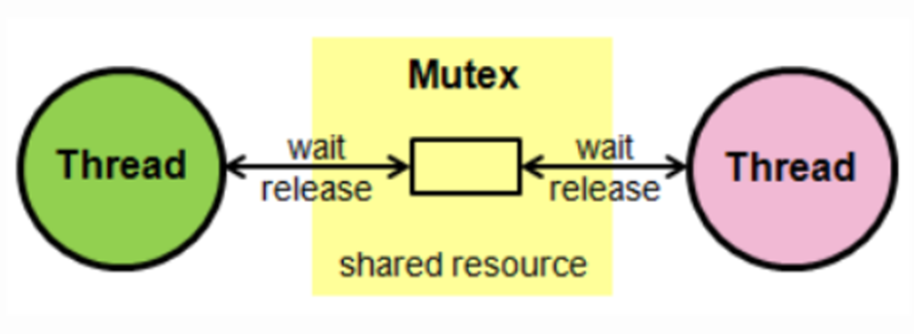
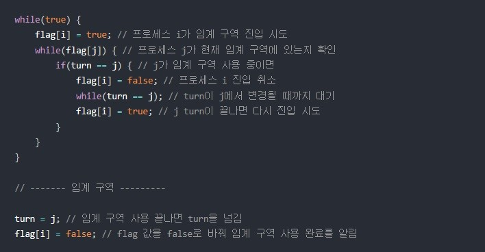
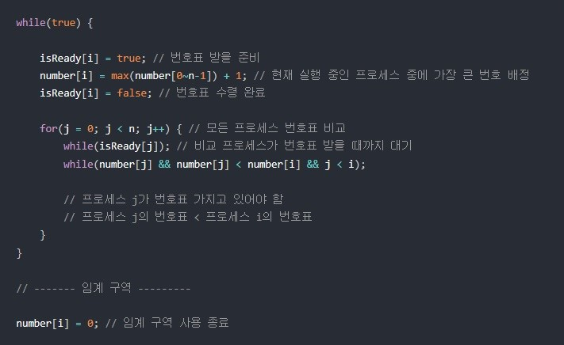
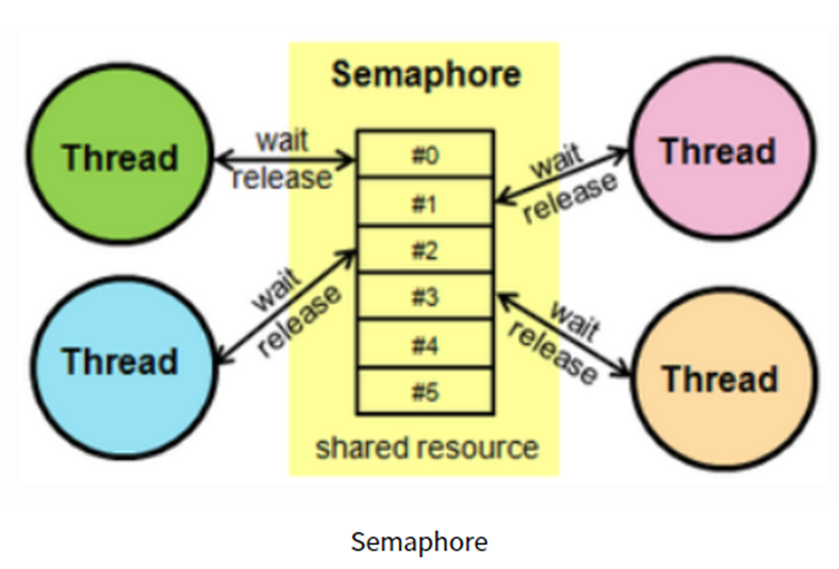

# 뮤텍스와 세마포어의 차이

## Mutex란?
* Mutual - 상호에서 떠올리면 쉬울듯 -> Mutex : 상호 배제, 상호 스레드 작용
* 그래서, 동기화 대상은 하나
* 한번에 하나의 스레드만 공유 리소스에 접근할 수 있다. 이를 통해 여러 스레드가 동시에 같은 자원에 접근하여 발생하는 충돌을 방지

  * 데커(Dekker) 알고리즘
       : flag와 turn 변수를 통해 임계 구역에 들어갈 프로세스/스레드를 결정하는 방식

  * flag : 프로세스 중 누가 임계영역에 진입할 것인지 나타내는 변수
  * turn : 누가 임계구역에 들어갈 차례인지 나타내는 변수
    

  * 피터슨(Peterson) 알고리즘
데커와 유사하지만, 상대방 프로세스/스레드에게 진입 기회를 양보하는 것에 차이가 있음
    
* Decker와 Peterson은 race condition이 발생할 수 있음
   
  * 베이커리(Backery) 알고리즘
  * 여러 프로세스/스레드에 대한 처리가 가능한 알고리즘. 가장 작은 수의 번호표를 가지고 있는 프로세스가 임계 구역에 진입
  * 안전하고, 현대적인 멀티스레드 환경에서 적용가능하다
  *그러나 자원의 갯수가 많아질 수록 대기열의 길이가 길어지는 문제가 있을 수 있으므로, 이러한 상황에서는 다른 뮤텍스 알고리즘을 사용하는 것이 더 나을 수 있음
     

## Semaphore란?
* S 스레드 여러개가 있는 모습을 떠올리면 좋을 듯
* 그래서, 동기화 대상은 여러개
* 스레드의 수를 제어하고, 스레드 간의 작업 진행을 조정하기 위해 사용한다. Semaphore는 특정 개수의 스레드만이 동시에 특정 코드 영역에 진입할 수 있도록 허용한다. Semaphore는 특정한 자원에 대한 접근을 제어하는 데 사용함

procedure P(S)   --> 최초 S값은 1임
    while S=0 do wait  --> S가 0면 1이 될때까지 기다려야 함
    S := S-1   --> S를 0로 만들어 다른 프로세스가 들어 오지 못하도록 함
end P

--- 임계 구역 ---

procedure V(S) --> 현재상태는 S가 0임
    S := S+1   --> S를 1로 원위치시켜 해제하는 과정
end V
이를 통해, 한 프로세스가 P 혹은 V를 수행하고 있는 동안 프로세스가 인터럽트 당하지 않게 된다. P와 V를 사용하여 임계 구역에 대한 상호배제 구현이 가능하게 되었다.

## References
[블로그 레퍼런스1](https://gyoogle.dev/blog/computer-science/operating-system/Semaphore%20&%20Mutex.html)
[블로그 레퍼런스2](https://heeonii.tistory.com/14)
