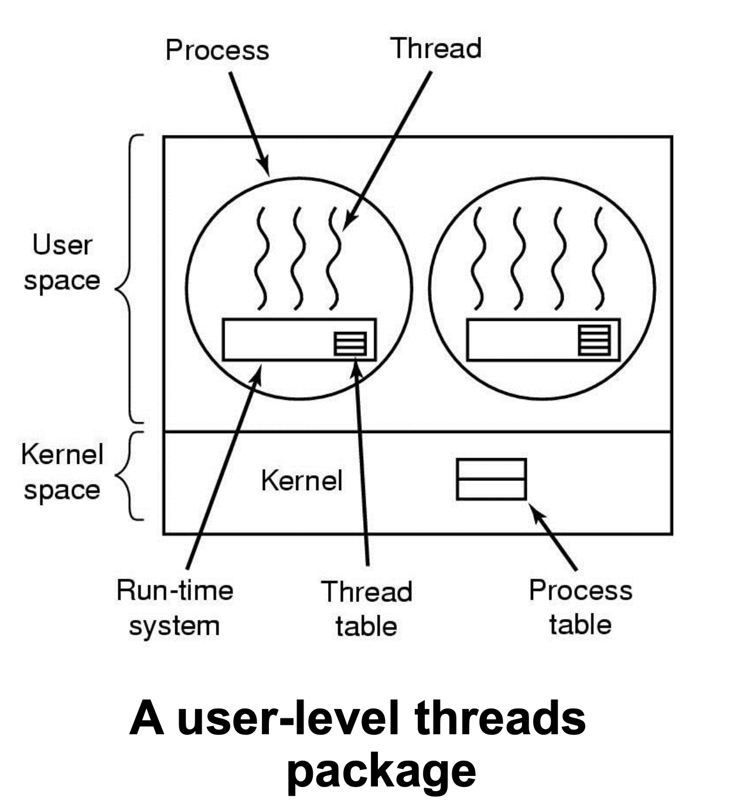
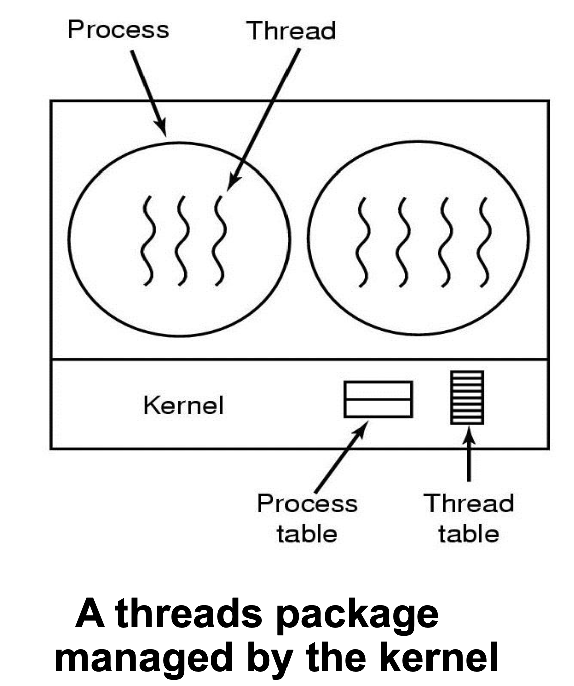

# 사용자 수준 스레드와 커널 수준 스레드

## 💡 User-Level Threads (사용자 수준 스레드)

사용자가 스레드 관련 라이브러리를 구현해 이를 사용하여 관리하는 스레드가 `user-level thread` 이다.

### 특징
- run-time systeam 에서 스레드 테이블을 관리함
- user-level 의 스레드 라이브러리를 활용하는 방식이므로 커널에 진입하지 않고 사용자 영역에서 스레드 연산을 수행함
- 커널은 스레드의 존재를 알지 못하고 프로세스만 알고있기 때문에 커널이 아닌 스레드 라이브러리에서 scheduling 을 제어함

 

### 장점

- user-level thread 가 kernel thread 보다 빠르다
  - 사용자 수준 스레드에서는 thread 생성, thread switching, thread 동기화를 system call(커널 호출)을 하지 않고 procedure call 을 통해 수행하기 때문에 커널의 개입이 필요하지 않아 훨씬 빠름
  - 커널이 스레드의 존재를 모르기 때문에 유저 모드와 커널 모드 간의 전환이 일어나지 않음

- user-level thread 는 모든 운영체제에 적용할 수 있다
  - 커널이 스레드의 존재를 모르는 상태에서 사용자 수준 스레드를 user-level 에 구현하기 때문에 이식성이 높음

- 각 프로세스마다 customized 된 스케줄링 알고리즘을 사용할 수 있다
  - 커널이 아닌 user-level 의 스레드 라이브러리에서 scheduling 을 제어하기 때문에 유연한 스케줄링이 가능함

- 커널 스레드보다 더 나은 scale 이 가능함
  - kernel thread 는 커널에서 스레드 테이블을 관리하고 있어 처음 스레드 테이블을 크게 만든 후 테이블의 크기를 변경하기가 어려움
  - user-level thread 는 각 프로세스 안에서 스레드 테이블이 만들어지기 때문에 확장성이 높음

### 단점

- blocking system call 발생 시 문제
  - 한 프로세스 내의 여러 스레드 중에서 한 스레드가 blocing system call (read) 을 함
     -> 해당 스레드를 block 상태로 보냄
     -> 한 스레드가 block 이 되면 OS가 다른 스레드에게 CPU를 넘겨줘야 하지만 커널은 스레드의 존재를 모르기 때문에 process 전체가 block 되었다고 생각하여 process 를 block 상태로 넘겨버림
     -> 따라서 다른 스레드들까지 전부 block 상태가 됨

    

    
해결 방법

     

      - nonblocing system call 을 사용한다
        - 어떤 경우에도 block 이 되지 않게 함
      - wrapper 를 씌워서 system call 을 했을 때 block 이 될지 미리 체크한다
        - wrapper 를 씌운 system call 을 하면 select system call 을 사용해 block 여부를 판단함
    

- 한 스레드가 다른 스레드에게 넘기지 않고 무한히 수행할 수도 있음
  - clock interrupt 가 발생하기 힘듬
  - scheduler 가 컨트롤을 다시 가져올 수 없음

 

- - -

## 💡 Kernel Threads (커널 수준 스레드)

OS에서 프로세스와 스레드를 모두 관리하여 모든 스레드 작업이 커널에서 구현되기 때문에 `kernel thread` 라고 한다.

### 특징

- 커널에서 프로세스 테이블과 함께 스레드 테이블을 관리함
- 커널이 프로세스와 스레드의 존재를 모두 알고있어 커널에서 thread scheduling 을 제어함

 

### 장점

- blocking system call 이 발생해도 모든 스레드가 block 되는 문제 생기지 않음
  - 한 프로세스 내의 한 스레드가 blocking system call 을 하게 되면
     -> OS 는 스레드의 존재를 알고있기 때문에 해당 스레드만 block 상태로 보냄
     -> 그럼에도 프로세스 내의 다른 스레드들은 계속 실행할 수 있음

### 단점

- kenel thread 가 user-level thread 에 비해 느림 (시간이 많이 걸림)
  - scheduling, 동기화 등 스레드 작업이 system call 을 통해 해야 하기 때문에 오래 걸림
  - 유저 모드와 커널 모드 간 전환이 빈번하게 일어나기 때문에 성능이 저하됨

 

- - -

> 👉 참고 
> [사용자 수준 스레드, 커널 수준 스레드](https://velog.io/@taehee-kim-dev/%EC%82%AC%EC%9A%A9%EC%9E%90-%EC%88%98%EC%A4%80-%EC%8A%A4%EB%A0%88%EB%93%9C-%EC%BB%A4%EB%84%90-%EC%88%98%EC%A4%80-%EC%8A%A4%EB%A0%88%EB%93%9C) 
> [[OS] 커널 레벨 스레드 vs 유저 레벨 스레드](https://colinch4.github.io/2020-02-02/%EC%BB%A4%EB%84%90%EB%A0%88%EB%B2%A8%EC%8A%A4%EB%A0%88%EB%93%9C-vs-%EC%9C%A0%EC%A0%80%EB%A0%88%EB%B2%A8%EC%8A%A4%EB%A0%88%EB%93%9C/)
