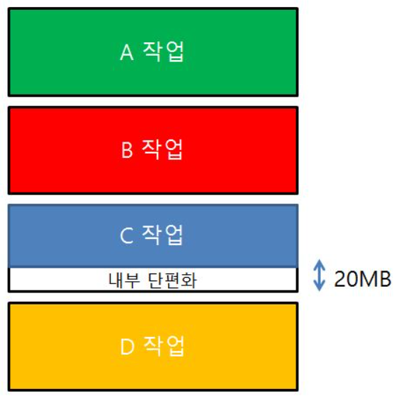
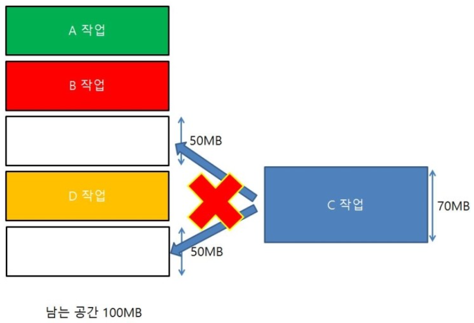

## Index

- [단편화(Fragmentation)](#단편화(Fragmentation))

- [내부 단편화](#내부-단편화)

- [외부 단편화](#외부-단편화)

- [해결 방법](#해결-방법)

- [References](#References)

---
 
 

## 단편화(Fragmentation)

* 주기억장치에 프로그램을 할당하고 반납하는 과정에서, 기억장소가 사용되지 않는 작은 조각 공간들로 나누어지는 현상

 
 

## 내부 단편화

* 메모리를 할당할 때 프로세스가 필요한 양보다 더 큰 메모리가 할당되어서 프로세스에서 사용하는 메모리 공간이 낭비되는 현상

* 주기억장치 내 사용자 영역이 실행 프로그램보다 커서, 프로그램의 사용 공간을 할당 후 사용되지 않고 남아있는 공간

> 주기억장치 내 사용자 영역 > 실행 프로그램

 
 

## 외부 단편화

* 중간중간에 사용하지 않는 메모리가 존재해서 총 메모리 공간은 충분하지만 실제로 할당은 할 수 없는 상황

* 실행 프로그램이 주기억장치 내 사용자 영역보다 커서, 프로그램이 할당될 수 없어 사용되지 않고 남아있는 공간

> 주기억장치 내 사용자 영역 < 실행 프로그램

 
 

## 해결 방법

* 압축(Garbage Collection)
    * 외부 단편화 해결
    * 메모리 `재배치`를 통해 분산(단편화)되어 있는 공간들을 하나로 합치는 기법
* 통합
    * 외부 단편화 해결
    * 단편화로 인해 분산된 메모리 공간들 중 `인접해 있는 공간끼리 통합`시켜 큰 메모리 공간으로 합치는 기법
* 페이징
    * 외부 단편화 해결
    * 프로세스의 가상 메모리를 고정 크기의 블록인 페이지(page) 단위로 분할하여 물리 메모리에 할당하는 기법
    * 페이지들은 논리적으로 연속적인 공간으로 할당되지만, 물리적으로는 분산되어 할당
* 세그멘테이션
    * 내부 단편화 해결
    * 프로세스의 가상 메모리를 서로 다른 크기의 블록인 세그먼트(Segment) 단위로 분할하여 물리 메모리에 할당하는 기법
    * 프로세스의 크기가 동적으로 변하는 경우에 효율적으로 메모리를 할당할 수 있어 내부 단편화 해결
* 메모리 풀(Memory Pool)
    * 외부 + 내부 단편화 해결
    * 필요한 메모리 공간을 사용자가 직접 지정하여 미리 할당받아놓고 필요할 때마다 사용하고 반납하는 기법
    * 미리 공간을 할당해놓고 사용하고 반납 -> 외부 단편화 해결
    * 필요한 크기만큼 할당 -> 내부 단편화 해결
    * if(단편화로 인한 낭비량 < pool을 만들었지만 쓰이지않는 메모리 양)이면 사용하지 않아야 함
    * 미리 할당해놓고 사용하지 않는 순간에도 메모리 누수가 일어나므로, 잦은 동적할당과 해제가 일어날 경우 사용하는 것이 바람직

 
 

## References

[단편화(Fragmentation)란? 내부 단편화와 외부 단편화란?](https://chelseashin.tistory.com/41)

[외부 단편화, 내부 단편화](https://knoc-story.tistory.com/8)

[내부 단편화(Internal Fragmentation)와 외부 단편화(External Fragmentation)](https://zu-techlog.tistory.com/132)
